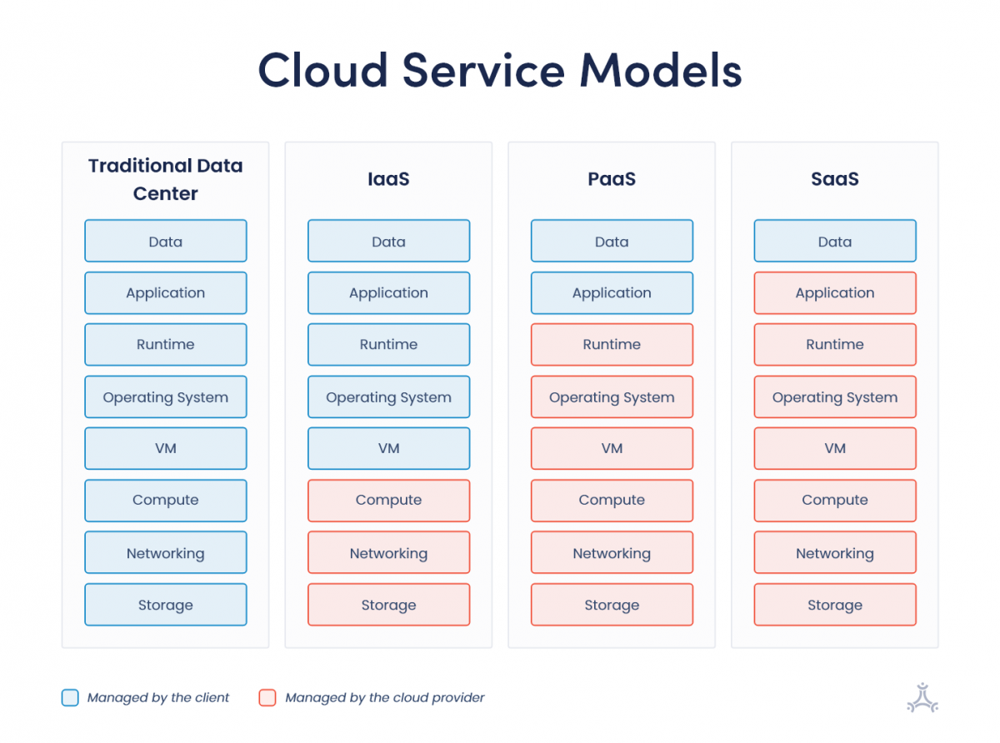

# Cloud Computing Guide

## What is Cloud Computing?

Cloud computing is the delivery of computing services—including servers, storage, databases, networking, software, analytics, and intelligence—over the Internet ("the cloud") to offer faster innovation, flexible resources, and economies of scale. Instead of owning their own computing infrastructure or data centers, companies can rent access to anything from applications to storage from a cloud service provider.

### Key Characteristics:
- **On-demand self-service**: Users can provision computing capabilities automatically without human interaction
- **Broad network access**: Services are available over the network via standard mechanisms
- **Resource pooling**: Provider's computing resources serve multiple consumers using a multi-tenant model
- **Rapid elasticity**: Capabilities can be elastically provisioned and released to scale with demand
- **Measured service**: Cloud systems automatically control and optimize resource use through metering capabilities

---

## Benefits of Cloud Computing to Business

### 1. **Cost Reduction**
- **Eliminates capital expenditure**: No need to invest in hardware, software, or infrastructure
- **Pay-as-you-go pricing**: Only pay for what you use, reducing waste
- **Reduced IT staff costs**: Less need for in-house IT maintenance teams
- **Lower operational costs**: No physical data center maintenance, cooling, or power costs

### 2. **Scalability and Flexibility**
- **Instant scalability**: Scale up or down based on business needs
- **Global reach**: Expand to new markets quickly without geographic constraints
- **Seasonal adjustments**: Handle peak loads during busy seasons without permanent infrastructure

### 3. **Business Continuity**
- **Disaster recovery**: Automated backups and recovery options ensure business continuity
- **High availability**: Services are available 24/7 with minimal downtime
- **Data redundancy**: Multiple backup locations protect against data loss

### 4. **Competitive Advantage**
- **Faster time to market**: Deploy applications and services quickly
- **Innovation enablement**: Access to latest technologies without large investments
- **Focus on core business**: IT infrastructure management is handled by providers

### 5. **Collaboration and Mobility**
- **Remote access**: Access data and applications from anywhere
- **Team collaboration**: Real-time collaboration tools and shared resources
- **Mobile workforce support**: Enable work-from-anywhere capabilities

### 6. **Security**
- **Enterprise-grade security**: Cloud providers invest heavily in security measures
- **Compliance**: Many providers offer compliance certifications (GDPR, HIPAA, etc.)
- **Regular updates**: Security patches and updates are handled automatically

---

## Technical Benefits of Cloud Computing

### 1. **Performance and Speed**
- **Global network**: Content delivery networks (CDNs) reduce latency
- **High-performance computing**: Access to powerful computing resources on demand
- **Optimized infrastructure**: Cloud providers optimize their infrastructure for performance

### 2. **Reliability and Availability**
- **99.99% uptime**: Service level agreements (SLAs) guarantee high availability
- **Automatic failover**: Redundant systems ensure continuous operation
- **Load balancing**: Distribute workloads across multiple servers

### 3. **Resource Management**
- **Auto-scaling**: Automatically adjust resources based on demand
- **Resource optimization**: Efficient use of computing resources
- **Monitoring and analytics**: Real-time monitoring of resource usage

### 4. **Development and DevOps**
- **CI/CD pipelines**: Continuous integration and deployment capabilities
- **Container orchestration**: Support for Docker, Kubernetes, etc.
- **Microservices architecture**: Easier to build and deploy microservices
- **API integration**: Easy integration with various APIs and services

### 5. **Data Management**
- **Big data analytics**: Process large datasets efficiently
- **Data warehousing**: Scalable data storage and analytics solutions
- **Machine Learning**: Access to ML and AI services
- **Database services**: Managed database services with automatic backups

### 6. **Infrastructure as Code**
- **Version control**: Infrastructure defined in code and version controlled
- **Reproducibility**: Consistent environments across development, staging, and production
- **Automation**: Automated provisioning and configuration management

---

## What is Virtualization?

Virtualization is the process of creating a virtual (rather than actual) version of something, including virtual computer hardware platforms, storage devices, and computer network resources. It allows multiple operating systems and applications to run on a single physical machine simultaneously.

### Types of Virtualization:

#### 1. **Server Virtualization**
- Divides a physical server into multiple isolated virtual servers
- Each virtual server can run its own operating system and applications
- Examples: VMware vSphere, Microsoft Hyper-V, Citrix XenServer

#### 2. **Network Virtualization**
- Combines network resources into a single software-based administrative entity
- Creates virtual networks independent of physical network infrastructure
- Examples: Software-Defined Networking (SDN), Network Function Virtualization (NFV)

#### 3. **Storage Virtualization**
- Abstracts physical storage from multiple network storage devices
- Presents them as a single storage pool
- Examples: Storage Area Networks (SAN), Network Attached Storage (NAS)

#### 4. **Desktop Virtualization**
- Hosts desktop operating systems on a centralized server
- Users access their desktops remotely
- Examples: Virtual Desktop Infrastructure (VDI), Desktop as a Service (DaaS)

#### 5. **Application Virtualization**
- Separates applications from the underlying operating system
- Applications run in isolated environments
- Examples: Docker containers, application streaming

### Benefits of Virtualization:
- **Resource utilization**: Better use of hardware resources
- **Cost savings**: Reduce hardware and energy costs
- **Isolation**: Applications and OSs are isolated from each other
- **Flexibility**: Easy to create, copy, and move virtual machines
- **Disaster recovery**: Faster backup and recovery processes

### Relationship to Cloud Computing:
Virtualization is a foundational technology for cloud computing. Cloud providers use virtualization to:
- Maximize resource utilization
- Provide multi-tenancy (multiple customers on same hardware)
- Enable rapid provisioning and scaling
- Isolate customer workloads for security

---

## What is a Data Center?

A data center is a facility used to house computer systems and associated components, such as telecommunications and storage systems. It generally includes redundant or backup power supplies, redundant data communications connections, environmental controls (e.g., air conditioning, fire suppression), and various security devices.

### Components of a Data Center:

#### 1. **Physical Infrastructure**
- **Servers**: Physical machines that run applications and services
- **Storage systems**: Hard drives, SSDs, tape storage for data
- **Networking equipment**: Routers, switches, firewalls, load balancers
- **Power systems**: Uninterruptible Power Supplies (UPS), generators, power distribution units
- **Cooling systems**: HVAC systems to maintain optimal temperature
- **Security systems**: Access controls, surveillance, biometric authentication

#### 2. **Network Infrastructure**
- **Internet connectivity**: High-bandwidth connections to the internet
- **Internal networks**: Local area networks (LANs) connecting servers
- **Redundancy**: Multiple network paths for reliability

#### 3. **Environmental Controls**
- **Temperature control**: Maintains optimal operating temperature (typically 18-27°C)
- **Humidity control**: Prevents static electricity and equipment damage
- **Fire suppression**: Advanced fire detection and suppression systems
- **Physical security**: Restricted access, surveillance, security personnel

### Types of Data Centers:

#### 1. **Enterprise Data Centers**
- Owned and operated by a single organization
- Located on-premises or in a dedicated facility
- Used for internal IT operations

#### 2. **Colocation Data Centers**
- Facilities where multiple organizations rent space
- Organizations bring their own hardware
- Provider supplies power, cooling, and connectivity

#### 3. **Cloud Data Centers**
- Owned and operated by cloud service providers
- Massive scale with thousands of servers
- Examples: AWS, Microsoft Azure, Google Cloud Platform

#### 4. **Edge Data Centers**
- Smaller facilities located closer to end users
- Reduce latency for time-sensitive applications
- Part of edge computing architecture

### Data Center Tiers:
- **Tier I**: Basic capacity (99.671% uptime)
- **Tier II**: Redundant capacity components (99.741% uptime)
- **Tier III**: Concurrently maintainable (99.982% uptime)
- **Tier IV**: Fault tolerant (99.995% uptime)

### Data Center vs. Cloud:
- **Traditional Data Center**: Physical facility you own and manage
- **Cloud Data Center**: Virtualized, managed by cloud providers
- **Hybrid**: Combination of on-premises and cloud resources

---

## Service Models in Cloud Computing

Cloud computing services are typically categorized into three main service models, often referred to as the "Cloud Computing Stack":

### 1. Infrastructure as a Service (IaaS)

**Definition**: Provides virtualized computing resources over the internet. Users rent IT infrastructure—servers, virtual machines, storage, networks, and operating systems—on a pay-as-you-go basis.

**Characteristics**:
- Highest level of flexibility and management control
- Users manage applications, data, runtime, middleware, and OS
- Provider manages virtualization, servers, storage, and networking

**Examples**:
- Amazon Web Services (AWS) EC2
- Microsoft Azure Virtual Machines
- Google Compute Engine
- DigitalOcean Droplets
- Rackspace

**Use Cases**:
- Web hosting
- Development and testing environments
- High-performance computing
- Disaster recovery
- Data backup and storage

**Advantages**:
- Full control over infrastructure
- Scalable and flexible
- Cost-effective (pay for what you use)
- No hardware maintenance

**Disadvantages**:
- Requires technical expertise
- Security responsibility shared with provider
- Need to manage OS and applications

---

### 2. Platform as a Service (PaaS)

**Definition**: Provides a platform allowing customers to develop, run, and manage applications without dealing with the complexity of building and maintaining the infrastructure typically associated with developing and launching an app.

**Characteristics**:
- Users manage applications and data
- Provider manages runtime, middleware, OS, virtualization, servers, storage, and networking
- Development tools, database management, and business analytics included

**Examples**:
- Google App Engine
- Microsoft Azure App Service
- Heroku
- AWS Elastic Beanstalk
- Salesforce Platform

**Use Cases**:
- Application development
- API development and management
- Business analytics
- Database management
- DevOps tooling

**Advantages**:
- Faster development and deployment
- Reduced coding effort
- Built-in scalability
- Multiple programming languages and frameworks supported
- Lower costs (no infrastructure management)

**Disadvantages**:
- Vendor lock-in risks
- Less control over infrastructure
- Limited customization options
- Security concerns with shared resources

---

### 3. Software as a Service (SaaS)

**Definition**: Delivers software applications over the internet, on a subscription basis. Cloud providers host and manage the software application and underlying infrastructure, and handle any maintenance.

**Characteristics**:
- Users only manage their data and user access
- Provider manages everything else (applications, runtime, middleware, OS, virtualization, servers, storage, networking)
- Accessible via web browsers or APIs

**Examples**:
- Google Workspace (Gmail, Google Docs, Sheets)
- Microsoft 365
- Salesforce
- Dropbox
- Slack
- Zoom
- Adobe Creative Cloud

**Use Cases**:
- Email and productivity tools
- Customer Relationship Management (CRM)
- Enterprise Resource Planning (ERP)
- Collaboration tools
- Human Resources Management (HRM)

**Advantages**:
- Easy to use (no technical knowledge required)
- Automatic updates and maintenance
- Accessible from anywhere
- Lower upfront costs
- Scalable user access

**Disadvantages**:
- Limited customization
- Data security concerns
- Dependency on internet connectivity
- Less control over software
- Potential vendor lock-in

---

### Comparison Table

| Feature | IaaS | PaaS | SaaS |
|---------|------|-----|------|
| **Control Level** | High | Medium | Low |
| **Management Responsibility** | User manages OS, apps, data | User manages apps, data | User manages data only |
| **Technical Expertise Required** | High | Medium | Low |
| **Scalability** | Manual | Automatic | Automatic |
| **Customization** | High | Medium | Low |
| **Cost** | Pay for resources | Pay for platform | Pay per user/feature |
| **Use Case** | Infrastructure needs | Development platform | Ready-to-use software |

---

### Other Service Models (Emerging)

#### 4. **Function as a Service (FaaS) / Serverless**
- Execute code in response to events without managing servers
- Examples: AWS Lambda, Azure Functions, Google Cloud Functions
- Pay only for execution time

#### 5. **Database as a Service (DBaaS)**
- Managed database services
- Examples: Amazon RDS, Azure SQL Database, MongoDB Atlas

#### 6. **Backend as a Service (BaaS)**
- Provides backend services for mobile and web apps
- Examples: Firebase, AWS Amplify, Parse

#### 7. **Container as a Service (CaaS)**
- Container-based virtualization services
- Examples: AWS ECS, Google Kubernetes Engine, Azure Container Instances

---

## Summary

Cloud computing has revolutionized how businesses and individuals use technology. By understanding:
- **What cloud computing is** and its core characteristics
- **Business and technical benefits** it provides
- **Virtualization** as the underlying technology
- **Data centers** as the physical foundation
- **Service models** (IaaS, PaaS, SaaS) and their use cases

Organizations can make informed decisions about adopting cloud technologies to improve efficiency, reduce costs, and drive innovation.

