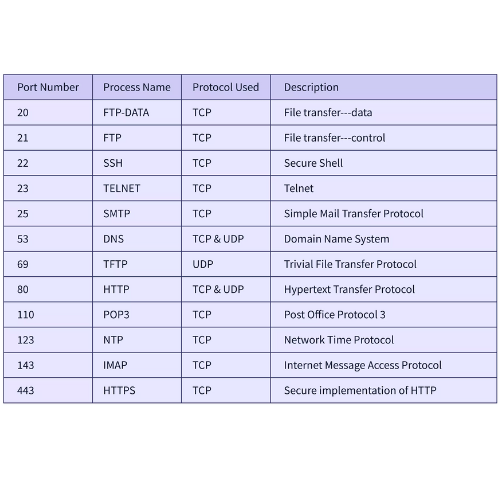

# Day 2: Security Groups and SSH

## Security Groups

### What is a Security Group?

A **Security Group** is a virtual firewall that controls inbound and outbound traffic for AWS resources like EC2 instances. It acts as a firewall at the instance level.

### Basic Characteristics:

- **Stateful**: If you allow inbound traffic, the corresponding outbound traffic is automatically allowed
- **Default Deny**: All inbound traffic is denied by default
- **Rules-Based**: Uses rules to allow or deny traffic based on:
  - Protocol (TCP, UDP, ICMP)
  - Port number
  - Source IP address

### Security Group Rules:

Each rule consists of:
- **Type**: Protocol type (SSH, HTTP, HTTPS, Custom TCP, etc.)
- **Port**: Port number (e.g., 22, 80, 443)
- **Source**: IP address or CIDR block (e.g., 0.0.0.0/0 for anywhere)

### Common Ports Reference:

The following image provides a quick reference guide for popular servers and their default port numbers, which are commonly used when configuring security group rules:



*Reference: Common port numbers for web servers, databases, remote access, email servers, and other network services*

---

## Example: Security Group with Nginx Web Server

### Step 1: Launch EC2 Instance with Default Security Group

1. Launch an EC2 instance (Ubuntu Server)
2. Use a key pair for SSH access
3. Use the default security group (or create a new one)
4. Note the public IP address
5. The default security group typically allows SSH (port 22) from anywhere

### Step 2: SSH into the Instance

Connect to your instance using SSH:

```bash
ssh -i your-key.pem ubuntu@<EC2-Public-IP>
```

### Step 3: Open Ports in Existing Security Group

After connecting via SSH, open the required ports in the security group:

1. Go to EC2 Dashboard → Security Groups
2. Select the security group attached to your instance
3. Click "Edit inbound rules"
4. Add the following rules (if not already present):

| Type | Protocol | Port Range | Source | Description |
|------|----------|------------|--------|-------------|
| SSH | TCP | 22 | Your IP | Allow SSH access |
| HTTP | TCP | 80 | 0.0.0.0/0 | Allow HTTP traffic from anywhere |
| HTTPS | TCP | 443 | 0.0.0.0/0 | Allow HTTPS traffic from anywhere |

5. Click "Save rules"

### Step 4: Install and Configure Nginx

Once connected via SSH, run the following commands:

```bash
# Switch to root user
sudo -i

# Update package list
apt update

# Install Nginx
apt install nginx -y

# Create custom index page
echo "<h1> Welcome to Pune</h1>" > /var/www/html/index.html

# Start Nginx service
systemctl start nginx

# Check Nginx status
systemctl status nginx
```

### Step 5: Verify the Setup

1. **Check Nginx is running:**
   ```bash
   systemctl status nginx
   ```

2. **Access from browser:**
   - Open a web browser
   - Navigate to: `http://<EC2-Public-IP>`
   - You should see: "Welcome to Pune"

---

## SSH (Secure Shell)

### What is SSH?

**SSH (Secure Shell)** is a secure network protocol used for remote login and command execution over an unsecured network. It provides encrypted communication between client and server.

### Basic Features:

- **Encrypted Communication**: All data is encrypted
- **Secure Authentication**: Uses passwords or cryptographic keys
- **Remote Access**: Access and manage remote servers securely

---

## How SSH Works

### SSH Connection Process:

1. **Client connects to server** on port 22
2. **Server authenticates itself** to the client
3. **Client authenticates** using password or key
4. **Encrypted session** is established
5. **Commands and data** are exchanged securely

### Simple Flow:

```
Client → (Encrypted Connection) → Server
```

---

## Public Key and Private Key

### What are Public and Private Keys?

SSH uses **public-key cryptography** for authentication. This involves a pair of keys:

### Private Key:
- **Kept Secret**: Never shared
- **Stored on Client**: Your computer
- **Purpose**: Used to authenticate

### Public Key:
- **Can be Shared**: Safe to share
- **Stored on Server**: Placed in `~/.ssh/authorized_keys`
- **Purpose**: Used to verify authentication

### How They Work:

1. Client generates a key pair (private + public)
2. Public key is copied to the server
3. When connecting, client uses private key to authenticate
4. Server verifies using the public key
5. If valid, access is granted

---

## How to Generate SSH Keys

### Step 1: Generate Key Pair

```bash
ssh-keygen -t rsa -b 4096
```

Or for modern systems:

```bash
ssh-keygen -t ed25519
```

### Step 2: Follow the Prompts

```bash
Enter file in which to save the key (/home/username/.ssh/id_rsa): 
# Press Enter to accept default location

Enter passphrase (empty for no passphrase): 
# Enter a passphrase (optional) or press Enter

Enter same passphrase again: 
# Confirm passphrase
```

### Step 3: View Your Keys

```bash
# List SSH keys
ls -la ~/.ssh/

# View public key
cat ~/.ssh/id_rsa.pub

# View private key
cat ~/.ssh/id_rsa
```

**Output:**
- `id_rsa` - Private key (keep secret!)
- `id_rsa.pub` - Public key (can be shared)

### Step 4: Copy Public Key to Server

```bash
# Display your public key
cat ~/.ssh/id_rsa.pub

# Copy the output, then SSH into server
ssh user@server_ip

# On the server, add public key
mkdir -p ~/.ssh
echo "your_public_key_here" >> ~/.ssh/authorized_keys
chmod 600 ~/.ssh/authorized_keys
```

### Step 5: Test Connection

```bash
ssh user@server_ip
```

You should now connect without entering a password.

---

## Summary

### Security Groups:
- Virtual firewalls for EC2 instances
- Control inbound and outbound traffic
- Rules-based configuration

### SSH:
- Secure protocol for remote access
- Uses public-key cryptography
- Private key (secret) and public key (shared)
- Generated using `ssh-keygen` command
