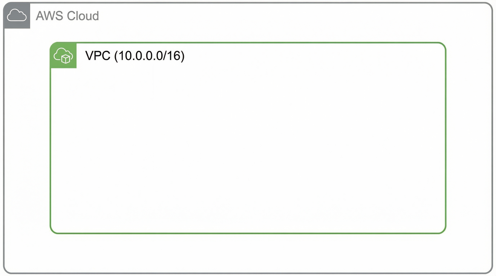
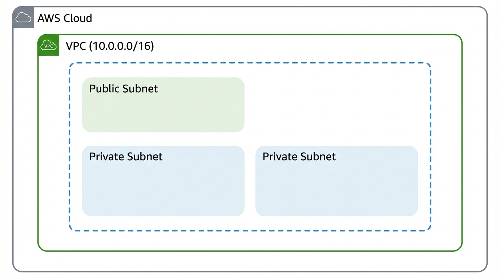
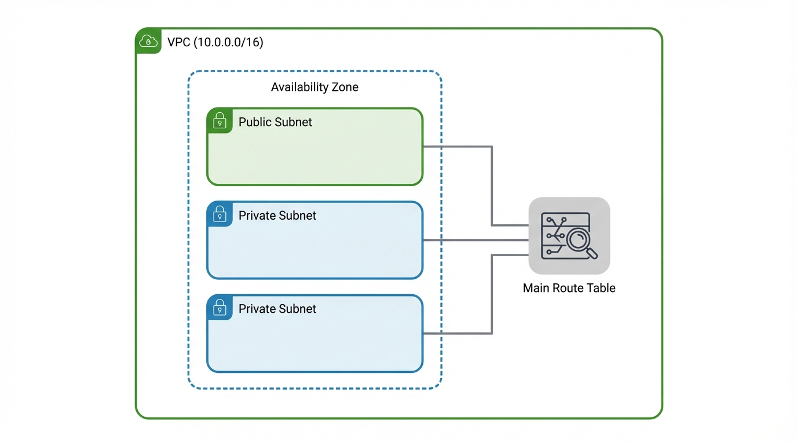
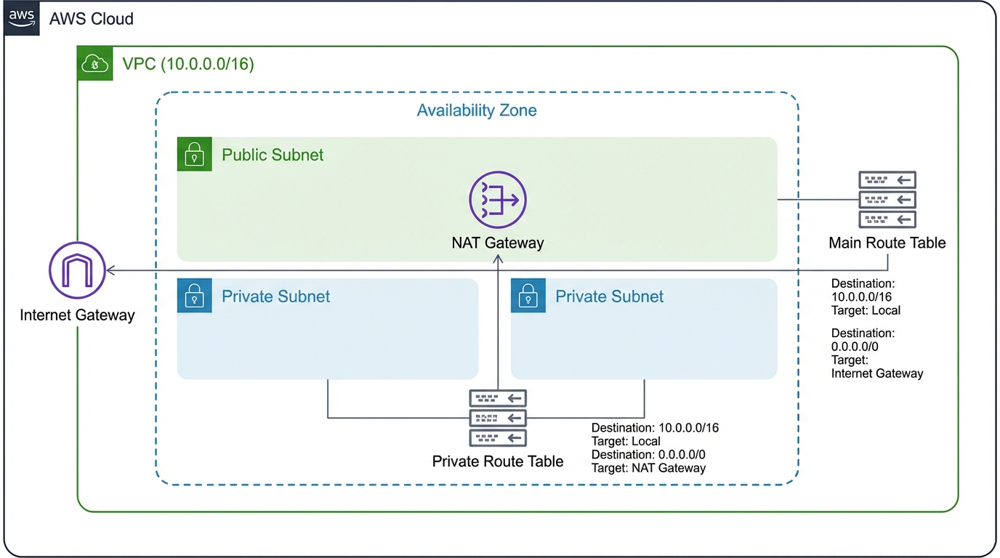

# Day 7: AWS VPC Fundamentals

## Introduction to VPC

Understanding AWS VPC (Virtual Private Cloud) is essential for:
- **Network Architecture**: Designing secure and scalable cloud networks
- **Security**: Implementing network-level security controls
- **Interview Preparation**: Common AWS interview topics
- **Certification Exams**: Core topic in AWS certifications (Solutions Architect, SysOps, etc.)
- **Real-world Applications**: Foundation for all AWS networking

---

## 1. What is VPC (Virtual Private Cloud)?

### Definition

**VPC (Virtual Private Cloud)** is a logically isolated section of the AWS cloud where you can launch AWS resources in a virtual network that you define. Think of it as your own private data center within AWS's public cloud infrastructure.

### Simple Explanation

Imagine AWS cloud as a huge apartment building. A VPC is like your own private apartment in that building. You have your own space, your own walls, your own security, and you control who can come in and out. But you're still inside the bigger building (AWS cloud) and can use all the building's facilities (AWS services).



### Key Characteristics

#### 1. **Logical Isolation**
- Your VPC is completely isolated from other customers' VPCs
- Resources in your VPC cannot directly communicate with resources in other customers' VPCs
- Each VPC acts as a separate network boundary
- Provides network-level security and privacy

#### 2. **Full Control**
- You control the IP address range (CIDR block)
- You decide how traffic flows (route tables)
- You configure subnets and network gateways
- You set up security groups and network ACLs
- Complete control over network configuration

#### 3. **Region-Specific**
- Each VPC exists in a single AWS region
- VPCs cannot span multiple regions
- You can create multiple VPCs in different regions
- Resources in a VPC are in the same region as the VPC

#### 4. **Customizable Network**
- Define your own IP address ranges
- Create subnets in different Availability Zones
- Configure routing between subnets
- Connect to internet or other networks as needed

### Why Do We Need VPC?

#### 1. **Network Security**
- Isolate your resources from other AWS customers
- Control inbound and outbound traffic
- Implement network-level security controls
- Create private networks for sensitive applications

#### 2. **IP Address Management**
- Use your own IP address ranges
- Plan and organize IP addresses logically
- Avoid IP address conflicts
- Support both IPv4 and IPv6

#### 3. **Network Segmentation**
- Separate different environments (dev, staging, production)
- Isolate different applications or services
- Create DMZ (Demilitarized Zone) networks
- Implement multi-tier architectures

#### 4. **Compliance and Governance**
- Meet regulatory requirements for network isolation
- Implement network access controls
- Audit network traffic
- Maintain network boundaries

#### 5. **Hybrid Cloud Connectivity**
- Connect VPC to on-premises data centers
- Extend corporate networks to AWS
- Create site-to-site VPN connections
- Use AWS Direct Connect for dedicated connections

### Default VPC vs Custom VPC

#### Default VPC
- **Automatically Created**: AWS creates a default VPC in each region when you create an AWS account
- **Pre-configured**: Comes with internet gateway, public subnets, and route tables already set up
- **Quick Start**: Good for beginners and quick testing
- **Limitations**: Less control, not suitable for production environments
- **CIDR Block**: Usually 172.31.0.0/16
- **Public Subnets**: Automatically created in each Availability Zone
- **Internet Gateway**: Automatically attached

#### Custom VPC
- **Manual Creation**: You create it yourself with your own configuration
- **Full Control**: Complete control over network design
- **Production Ready**: Suitable for production environments
- **Flexibility**: Design according to your specific requirements
- **Custom CIDR**: Choose your own IP address range
- **Custom Subnets**: Create subnets as per your needs
- **Custom Routing**: Configure route tables as required

### VPC Components

A VPC consists of several key components that work together:

1. **Subnets**: Divide VPC into smaller networks
2. **Route Tables**: Control traffic routing
3. **Internet Gateway**: Connect to the internet
4. **NAT Gateway**: Allow private subnets to access internet
5. **Security Groups**: Stateful firewall at instance level
6. **Network ACLs**: Stateless firewall at subnet level
7. **VPC Peering**: Connect multiple VPCs
8. **VPC Endpoints**: Private connectivity to AWS services

### VPC CIDR Blocks

#### What is CIDR?
- **CIDR (Classless Inter-Domain Routing)**: A method for allocating IP addresses
- **Format**: Written as IP address followed by slash and number (e.g., 10.0.0.0/16)
- **Purpose**: Defines the IP address range for your VPC

#### CIDR Notation Explained
- **10.0.0.0/16**: Means first 16 bits are network, last 16 bits are for hosts
- **/16**: Provides 65,536 IP addresses (2^16)
- **/24**: Provides 256 IP addresses (2^8)
- **/28**: Provides 16 IP addresses (2^4)

#### Allowed CIDR Ranges
- **Minimum**: /28 (16 IP addresses)
- **Maximum**: /16 (65,536 IP addresses)
- **Common Ranges**: /16, /20, /24
- **Private IP Ranges**: 
  - 10.0.0.0/8 (10.0.0.0 to 10.255.255.255)
  - 172.16.0.0/12 (172.16.0.0 to 172.31.255.255)
  - 192.168.0.0/16 (192.168.0.0 to 192.168.255.255)

#### Important Notes
- CIDR blocks cannot overlap between VPCs that need to communicate
- Once created, VPC CIDR cannot be changed (must delete and recreate)
- Subnet CIDR must be within VPC CIDR
- AWS reserves 5 IP addresses in each subnet

### VPC Lifecycle

#### Creation
- Define CIDR block
- Choose region
- Configure DNS settings
- Set up DHCP options

#### Configuration
- Create subnets
- Set up route tables
- Attach internet gateway
- Configure security groups

#### Usage
- Launch EC2 instances
- Deploy applications
- Connect to internet or other networks
- Monitor network traffic

#### Deletion
- Delete all resources first (instances, load balancers, etc.)
- Detach internet gateways
- Delete subnets
- Delete route tables
- Finally delete VPC

### VPC Best Practices

#### 1. **IP Address Planning**
- Plan CIDR blocks carefully before creation
- Leave room for future growth
- Use non-overlapping ranges
- Document your IP address scheme

#### 2. **Multi-AZ Deployment**
- Create subnets in multiple Availability Zones
- Distribute resources across AZs for high availability
- Avoid single point of failure

#### 3. **Network Segmentation**
- Separate public and private subnets
- Isolate different environments
- Use separate VPCs for different projects if needed

#### 4. **Security**
- Use security groups for instance-level security
- Use network ACLs for subnet-level security
- Implement least privilege access
- Regularly review security group rules

#### 5. **Monitoring**
- Enable VPC Flow Logs for traffic monitoring
- Monitor network performance
- Set up CloudWatch alarms
- Review security group changes

---

## 2. What is Subnet?

### Definition

A **Subnet (Subnetwork)** is a logical subdivision of a VPC's IP address range. It's like dividing your apartment (VPC) into different rooms (subnets) - each room has its own purpose and can have different access rules.

### Simple Explanation

Think of VPC as your entire house, and subnets as different rooms in that house. You might have:
- **Living Room (Public Subnet)**: Where guests can come (internet accessible)
- **Bedroom (Private Subnet)**: Only family members can access (no direct internet)
- **Kitchen (Database Subnet)**: Special area with restricted access

Each room (subnet) is in a specific location (Availability Zone) and has its own rules about who can enter.



### Key Characteristics

#### 1. **IP Address Range**
- Each subnet has its own CIDR block
- Subnet CIDR must be within VPC CIDR
- Subnets cannot have overlapping CIDR blocks
- AWS reserves 5 IP addresses in each subnet

#### 2. **Availability Zone Binding**
- Each subnet exists in exactly one Availability Zone
- Cannot span multiple Availability Zones
- Cannot move subnet to different AZ after creation
- Important for high availability design

#### 3. **Route Table Association**
- Each subnet must be associated with a route table
- Route table determines how traffic is routed
- Default route table or custom route table
- Can change route table association anytime

#### 4. **Network ACL Association**
- Each subnet has a network ACL (default or custom)
- Network ACL provides subnet-level firewall
- Controls traffic at subnet boundary
- Stateless firewall rules

### Why Do We Need Subnets?

#### 1. **Network Segmentation**
- Separate different types of resources
- Isolate public-facing resources from private resources
- Create different security zones
- Organize resources logically

#### 2. **High Availability**
- Distribute resources across multiple Availability Zones
- Avoid single point of failure
- Ensure redundancy
- Meet availability requirements

#### 3. **Security Isolation**
- Separate public and private resources
- Isolate sensitive data (databases)
- Create DMZ networks
- Implement defense in depth

#### 4. **Traffic Control**
- Control how traffic flows between resources
- Implement different routing rules
- Control internet access
- Manage network boundaries

#### 5. **IP Address Management**
- Organize IP addresses logically
- Plan IP allocation efficiently
- Avoid IP address conflicts
- Support different network requirements

### Subnet Types

#### 1. Public Subnet

**Definition**: A subnet that has direct access to the internet through an Internet Gateway. Resources in public subnets can have public IP addresses and can be accessed from the internet.

**Characteristics**:
- **Internet Access**: Direct access to internet via Internet Gateway
- **Public IP**: Resources can have public IP addresses
- **Route Table**: Has route to Internet Gateway (0.0.0.0/0 → IGW)
- **Use Cases**: Web servers, load balancers, bastion hosts, NAT instances
- **Security**: More exposed, requires strong security groups

**How It Works**:
- Route table has route: 0.0.0.0/0 → Internet Gateway
- Traffic destined for internet goes through Internet Gateway
- Internet traffic can reach resources in public subnet (if security groups allow)
- Resources can initiate outbound internet connections

**When to Use**:
- Web servers that need to be accessible from internet
- Load balancers that receive internet traffic
- Bastion hosts for SSH access
- NAT Gateways (for private subnet internet access)
- Resources that need direct internet connectivity

**Security Considerations**:
- More vulnerable to internet attacks
- Requires strict security group rules
- Should only expose necessary ports
- Regular security updates required
- Consider using WAF (Web Application Firewall)

#### 2. Private Subnet

**Definition**: A subnet that does NOT have direct access to the internet. Resources in private subnets cannot be directly accessed from the internet and typically don't have public IP addresses.

**Characteristics**:
- **No Direct Internet Access**: Cannot directly reach internet
- **Private IP Only**: Resources typically have only private IP addresses
- **Route Table**: Does NOT have route to Internet Gateway
- **Use Cases**: Application servers, databases, internal services
- **Security**: More secure, isolated from internet

**How It Works**:
- Route table does NOT have route to Internet Gateway
- Traffic destined for internet cannot leave (or goes through NAT)
- Internet traffic cannot directly reach resources
- Resources can communicate within VPC and with other VPCs

**When to Use**:
- Application servers that don't need direct internet access
- Databases that should never be exposed to internet
- Internal microservices
- Backend services
- Resources that need high security

**Security Considerations**:
- More secure by default
- Cannot be directly attacked from internet
- Still need security groups for internal traffic
- Can use NAT Gateway for outbound internet access if needed
- Ideal for sensitive data

### Public Subnet vs Private Subnet Comparison

| Feature | Public Subnet | Private Subnet |
|---------|---------------|----------------|
| **Internet Access** | Direct via Internet Gateway | No direct access (or via NAT) |
| **Public IP** | Can have public IP | Typically private IP only |
| **Internet Reachable** | Yes (if security groups allow) | No |
| **Route to IGW** | Yes (0.0.0.0/0 → IGW) | No |
| **Security Level** | Lower (more exposed) | Higher (more isolated) |
| **Use Cases** | Web servers, load balancers | Databases, app servers |
| **Cost** | Standard | May need NAT Gateway (additional cost) |
| **Outbound Internet** | Direct | Via NAT Gateway (if configured) |

### Subnet Sizing

#### Minimum Subnet Size
- **/28**: Minimum subnet size (16 IP addresses)
- **Why**: AWS needs 5 reserved IPs, leaving 11 usable IPs
- **Use Case**: Very small deployments, testing

#### Maximum Subnet Size
- **/16**: Maximum subnet size (65,536 IP addresses)
- **Why**: Matches maximum VPC size
- **Use Case**: Large deployments, but not recommended

#### Recommended Subnet Sizes
- **/24 (256 IPs)**: Most common, good for most use cases
- **/20 (4,096 IPs)**: For larger deployments
- **/28 (16 IPs)**: For very small deployments

#### IP Address Calculation
- **Total IPs**: 2^(32 - subnet_mask)
- **Usable IPs**: Total IPs - 5 (AWS reserved)
- **Example**: /24 = 256 total IPs, 251 usable IPs

### Reserved IP Addresses in Subnets

AWS automatically reserves 5 IP addresses in every subnet that cannot be assigned to your resources:

1. **Network Address** (First IP): Represents the network itself
2. **VPC Router** (Second IP): Default gateway for the subnet
3. **DNS Server** (Third IP): Amazon-provided DNS server
4. **Reserved for Future Use** (Fourth IP): Reserved by AWS
5. **Broadcast Address** (Last IP): Network broadcast address

**Important**: Always subtract 5 from total IPs when planning subnet capacity.

### Subnet Design Best Practices

#### 1. **Multi-AZ Design**
- Create subnets in at least 2 Availability Zones
- Distribute resources across AZs
- Ensure high availability
- Avoid single point of failure

#### 2. **Tiered Architecture**
- **Public Subnets**: Web tier, load balancers
- **Private Subnets**: Application tier, databases
- **Separate Subnets**: Different environments (dev, staging, prod)

#### 3. **IP Address Planning**
- Plan subnet sizes based on expected growth
- Leave room for future expansion
- Use consistent CIDR blocks across environments
- Document your IP address scheme

#### 4. **Security Segmentation**
- Separate public and private resources
- Isolate databases in separate subnets
- Use different subnets for different security levels
- Implement defense in depth

#### 5. **Route Table Strategy**
- Use separate route tables for public and private subnets
- Public subnets: Route to Internet Gateway
- Private subnets: No route to Internet Gateway (or route to NAT)
- Keep routing simple and clear

---

## 3. What is Route Table?

### Definition

A **Route Table** is a set of rules (routes) that determines where network traffic from your subnet or gateway is directed. Think of it as a GPS navigation system for your network - it tells traffic which path to take to reach its destination.

### Simple Explanation

Imagine you're in a city and want to go somewhere. A route table is like a map that tells you:
- "To go to the internet, take the Internet Gateway road"
- "To go to another subnet in your VPC, take the local network road"
- "To go to your office network, take the VPN road"

Each subnet has a route table that acts as this navigation system, directing traffic to the right destination.



### Key Characteristics

#### 1. **Route Rules**
- Contains multiple routing rules
- Each rule specifies destination and target
- Rules are evaluated in order
- Most specific route matches first

#### 2. **Subnet Association**
- Each subnet must be associated with a route table
- One route table can be associated with multiple subnets
- Can change association anytime
- Default route table or custom route table

#### 3. **Destination and Target**
- **Destination**: Where traffic wants to go (CIDR block)
- **Target**: How to reach that destination (gateway, instance, etc.)
- Examples: 0.0.0.0/0 → Internet Gateway, 10.0.0.0/16 → Local

#### 4. **Default Route**
- Default route: 0.0.0.0/0 (all traffic)
- Usually points to Internet Gateway or NAT Gateway
- Acts as catch-all for internet-bound traffic

### Why Do We Need Route Tables?

#### 1. **Traffic Routing**
- Control how traffic flows in your network
- Direct traffic to correct destinations
- Implement network routing logic
- Manage traffic paths

#### 2. **Internet Connectivity**
- Enable internet access for public subnets
- Control which subnets can access internet
- Route internet traffic through Internet Gateway
- Manage outbound internet connections

#### 3. **Network Segmentation**
- Route traffic between different subnets
- Control inter-subnet communication
- Implement network isolation
- Manage VPC peering traffic

#### 4. **Hybrid Cloud**
- Route traffic to on-premises networks
- Connect VPC to corporate networks
- Manage VPN connections
- Control Direct Connect routing

#### 5. **Security Control**
- Control which paths traffic can take
- Prevent unauthorized routing
- Implement network-level security
- Manage access to different network segments

### How Route Tables Work

#### Route Evaluation Process

1. **Traffic Originates**: Resource in subnet wants to send traffic
2. **Check Route Table**: System checks subnet's associated route table
3. **Match Destination**: Finds route that matches destination IP
4. **Select Target**: Uses target specified in matching route
5. **Route Traffic**: Sends traffic to specified target
6. **Default Route**: If no match, uses default route (if exists)

#### Route Matching Logic

- **Most Specific First**: More specific routes (smaller CIDR) are checked first
- **Longest Prefix Match**: Route with longest matching prefix wins
- **Example**: 10.0.1.0/24 is more specific than 10.0.0.0/16
- **Default Route**: 0.0.0.0/0 matches everything (least specific)

### Default Route Table

#### Characteristics
- **Automatic Creation**: Created automatically when VPC is created
- **Local Route**: Automatically has route for VPC CIDR (local traffic)
- **Subnet Association**: All subnets use default route table initially
- **Modifiable**: Can add, modify, or remove routes
- **Cannot Delete**: Cannot delete default route table

#### Default Routes
- **Local Route**: VPC CIDR → local (for intra-VPC communication)
- **Example**: 10.0.0.0/16 → local (allows communication within VPC)

### Custom Route Tables

#### Characteristics
- **Manual Creation**: You create custom route tables as needed
- **Flexible**: Can have different routes for different subnets
- **Deletable**: Can delete custom route tables (if not associated)
- **Multiple Tables**: Can create multiple route tables per VPC

#### Use Cases
- **Public Subnets**: Route table with Internet Gateway route
- **Private Subnets**: Route table without Internet Gateway route
- **Different Environments**: Separate route tables for dev/staging/prod
- **Complex Routing**: Custom routing for specific requirements

### Common Route Table Configurations

#### 1. Public Subnet Route Table

**Purpose**: Allow internet access for resources in public subnet

**Routes**:
- **Local Traffic**: VPC CIDR → local (e.g., 10.0.0.0/16 → local)
- **Internet Traffic**: 0.0.0.0/0 → Internet Gateway

**Example**:
```
Destination        Target
10.0.0.0/16        local
0.0.0.0/0          igw-12345678
```

**Result**: Resources can access internet and other VPC resources

#### 2. Private Subnet Route Table

**Purpose**: Isolate resources from direct internet access

**Routes**:
- **Local Traffic**: VPC CIDR → local (e.g., 10.0.0.0/16 → local)
- **No Internet Route**: No route to Internet Gateway

**Example**:
```
Destination        Target
10.0.0.0/16        local
```

**Result**: Resources can access other VPC resources but NOT internet

#### 3. Private Subnet with NAT Gateway

**Purpose**: Allow outbound internet access without inbound access

**Routes**:
- **Local Traffic**: VPC CIDR → local
- **Internet Traffic**: 0.0.0.0/0 → NAT Gateway

**Example**:
```
Destination        Target
10.0.0.0/16        local
0.0.0.0/0          nat-12345678
```

**Result**: Resources can make outbound internet connections but cannot receive inbound traffic

#### 4. VPC Peering Route Table

**Purpose**: Enable communication with peered VPC

**Routes**:
- **Local Traffic**: VPC CIDR → local
- **Peered VPC Traffic**: Peered VPC CIDR → peering connection

**Example**:
```
Destination        Target
10.0.0.0/16        local
10.1.0.0/16        pcx-12345678
```

**Result**: Resources can communicate with resources in peered VPC

### Route Table Targets

#### 1. **Local**
- **Purpose**: Route traffic within VPC
- **Target**: Automatically created for VPC CIDR
- **Use Case**: Communication between subnets in same VPC
- **Cannot Modify**: Automatically managed by AWS

#### 2. **Internet Gateway (IGW)**
- **Purpose**: Route traffic to/from internet
- **Target**: Internet Gateway ID (e.g., igw-12345678)
- **Use Case**: Public subnets, internet connectivity
- **Bidirectional**: Allows both inbound and outbound internet traffic

#### 3. **NAT Gateway**
- **Purpose**: Route outbound internet traffic from private subnets
- **Target**: NAT Gateway ID (e.g., nat-12345678)
- **Use Case**: Private subnets needing outbound internet access
- **Unidirectional**: Only outbound traffic (no inbound from internet)

#### 4. **VPC Peering Connection**
- **Purpose**: Route traffic to peered VPC
- **Target**: Peering connection ID (e.g., pcx-12345678)
- **Use Case**: Communication between VPCs
- **Bidirectional**: Both VPCs need routes to each other

#### 5. **Virtual Private Gateway (VGW)**
- **Purpose**: Route traffic to on-premises network via VPN
- **Target**: Virtual Private Gateway ID (e.g., vgw-12345678)
- **Use Case**: Site-to-site VPN, Direct Connect
- **Bidirectional**: Connects VPC to corporate network

#### 6. **Network Interface**
- **Purpose**: Route traffic to specific network interface
- **Target**: Network interface ID (e.g., eni-12345678)
- **Use Case**: NAT instances, custom routing
- **Specific**: Routes to specific EC2 instance

### Route Table Limitations

#### 1. **Routes Per Route Table**
- **Soft Limit**: Maximum 50 routes per route table
- **Can Increase**: Can be increased to 100+ by request
- **Why**: Routing table lookup performance
- **Solution**: Request limit increase if needed

#### 2. **Route Tables Per VPC**
- **Soft Limit**: Maximum 200 route tables per VPC
- **Can Increase**: Can be increased by request
- **Why**: Resource management
- **Solution**: Usually sufficient for most use cases

#### 3. **Default Route Table**
- **Cannot Delete**: Default route table cannot be deleted
- **Always Exists**: One default route table per VPC
- **Can Modify**: Can add/remove routes from default table
- **Best Practice**: Use custom route tables for better organization

### Route Table Best Practices

#### 1. **Separate Route Tables**
- Use different route tables for public and private subnets
- Keep routing logic clear and simple
- Avoid complex routing when possible
- Document your routing strategy

#### 2. **Minimize Routes**
- Keep number of routes to minimum
- Combine routes when possible
- Remove unused routes
- Regularly review and clean up routes

#### 3. **Clear Naming**
- Use descriptive names for route tables
- Indicate purpose in name (e.g., "public-subnet-rt", "private-subnet-rt")
- Follow consistent naming convention
- Document route table purposes

#### 4. **Testing**
- Test routing changes in non-production first
- Verify internet connectivity after changes
- Test inter-subnet communication
- Monitor for routing issues

#### 5. **Documentation**
- Document all custom routes
- Explain routing logic
- Keep diagrams of network topology
- Update documentation when changes are made

---

## 4. What is Internet Gateway (IGW)?

### Definition

An **Internet Gateway (IGW)** is a horizontally scaled, redundant, and highly available VPC component that allows communication between resources in your VPC and the internet. It serves as the gateway (door) between your private VPC network and the public internet.

### Simple Explanation

Think of Internet Gateway as the main entrance door of your apartment (VPC) that connects to the outside world (internet). Just like you need a door to go in and out of your apartment, your VPC needs an Internet Gateway to communicate with the internet. It's a two-way door - you can go out to the internet, and people from the internet can come in (if you allow them through security groups).

### Key Characteristics

#### 1. **Horizontally Scaled**
- Automatically scales to handle traffic
- No bandwidth limitations from IGW itself
- Handles any amount of traffic
- AWS manages scaling automatically

#### 2. **Highly Available**
- Built-in redundancy
- No single point of failure
- Automatically distributed across Availability Zones
- 99.99% availability SLA

#### 3. **Redundant**
- Multiple redundant components
- Automatic failover
- No maintenance windows
- Always available

#### 4. **VPC Attachment**
- Attached to one VPC at a time
- One IGW per VPC (maximum)
- Cannot share IGW across VPCs
- Region-specific resource

### Why Do We Need Internet Gateway?

#### 1. **Internet Connectivity**
- Enable internet access for VPC resources
- Allow resources to reach internet services
- Enable public-facing applications
- Support outbound internet connections

#### 2. **Public Access**
- Allow internet users to access your resources
- Host public websites and APIs
- Enable public-facing services
- Support inbound internet traffic

#### 3. **Bidirectional Communication**
- Both inbound and outbound traffic
- Resources can initiate connections to internet
- Internet can initiate connections to resources
- Full two-way communication

#### 4. **Public IP Translation**
- Translates between private and public IPs
- Allows resources with private IPs to access internet
- Enables public IP assignment to resources
- Handles NAT (Network Address Translation)

#### 5. **No Additional Cost**
- No hourly charges for Internet Gateway
- No data processing charges
- Only pay for data transfer (standard AWS data transfer pricing)
- Cost-effective internet connectivity

### How Internet Gateway Works

#### Basic Functionality

1. **Attachment**: Internet Gateway is attached to VPC
2. **Route Table**: Route table has route: 0.0.0.0/0 → Internet Gateway
3. **Outbound Traffic**: Resource sends traffic to internet
4. **IGW Processing**: Internet Gateway receives traffic
5. **NAT Translation**: IGW translates private IP to public IP
6. **Internet Routing**: Traffic is sent to internet
7. **Response**: Internet response comes back through IGW
8. **Reverse Translation**: IGW translates public IP back to private IP
9. **Delivery**: Response delivered to original resource

#### Traffic Flow - Outbound (VPC to Internet)

1. **Resource Initiates**: EC2 instance in public subnet wants to access internet
2. **Route Check**: Route table directs traffic to Internet Gateway
3. **IGW Receives**: Internet Gateway receives the traffic
4. **IP Translation**: IGW translates private IP to public IP
5. **Internet Routing**: Traffic is routed to internet destination
6. **Response**: Internet server responds
7. **Reverse Translation**: IGW translates response back
8. **Delivery**: Response delivered to original instance

#### Traffic Flow - Inbound (Internet to VPC)

1. **Internet Request**: Internet user wants to access your resource
2. **Public IP**: Request comes to resource's public IP
3. **IGW Receives**: Internet Gateway receives the request
4. **IP Translation**: IGW translates public IP to private IP
5. **Route Check**: Traffic is routed to correct subnet
6. **Security Group**: Security group rules are checked
7. **Delivery**: If allowed, traffic reaches the resource
8. **Response**: Resource responds through IGW back to internet

### Internet Gateway vs NAT Gateway

#### Internet Gateway (IGW)

**Characteristics**:
- **Bidirectional**: Both inbound and outbound traffic
- **Public IP**: Resources can have public IP addresses
- **Cost**: No additional charges (only data transfer)
- **Use Case**: Public subnets, public-facing resources
- **Traffic**: Internet can initiate connections to resources

**When to Use**:
- Web servers that need to be accessible from internet
- Load balancers receiving internet traffic
- Resources that need public IP addresses
- Public-facing applications

#### NAT Gateway

**Characteristics**:
- **Unidirectional**: Only outbound traffic (no inbound from internet)
- **Private IP**: Resources have only private IP addresses
- **Cost**: ~$32/month + data processing charges
- **Use Case**: Private subnets needing outbound internet access
- **Traffic**: Resources can initiate outbound connections only

**When to Use**:
- Private subnets needing to download updates
- Application servers needing to call external APIs
- Resources that should not be directly accessible from internet
- Secure outbound internet access

### Internet Gateway Configuration

#### 1. **Creation**
- Create Internet Gateway in VPC
- Internet Gateway is region-specific
- One IGW can be attached to one VPC
- IGW exists independently until attached

#### 2. **Attachment**
- Attach IGW to VPC
- Attachment is immediate
- IGW becomes available once attached
- Cannot attach multiple IGWs to one VPC

#### 3. **Route Table Configuration**
- Add route: 0.0.0.0/0 → Internet Gateway
- Route table must be associated with subnet
- Subnet becomes "public" with this route
- Without this route, subnet remains "private"

#### 4. **Public IP Assignment**
- Enable auto-assign public IP for subnet
- Or manually assign Elastic IP to instances
- Resources need public IP for inbound internet access
- Public IP enables internet connectivity

### Internet Gateway Limitations

#### 1. **One IGW Per VPC**
- **Limit**: Maximum 1 Internet Gateway per VPC
- **Cannot Increase**: Hard limit, cannot be increased
- **Why**: Simplified routing, single point of internet access
- **Workaround**: Use multiple VPCs if needed

#### 2. **One VPC Per IGW**
- **Limit**: IGW can be attached to only one VPC at a time
- **Cannot Share**: Cannot share IGW across VPCs
- **Why**: VPC isolation, security boundaries
- **Workaround**: Create separate IGW for each VPC

#### 3. **Region-Specific**
- **Limit**: IGW exists in one region only
- **Cannot Span**: Cannot span multiple regions
- **Why**: Regional resource, region-specific networking
- **Workaround**: Create IGW in each region

#### 4. **IPv6 Support**
- **Support**: IGW supports both IPv4 and IPv6
- **Requirement**: Must explicitly enable IPv6 on VPC
- **Limitation**: Not all instance types support IPv6
- **Consideration**: Plan for IPv6 if needed

### Internet Gateway Best Practices

#### 1. **Public Subnet Design**
- Use Internet Gateway only in public subnets
- Keep private subnets without IGW route
- Separate public and private resources
- Implement proper security groups

#### 2. **Security**
- Use security groups to control access
- Only allow necessary ports from internet
- Implement defense in depth
- Regularly review security group rules

#### 3. **IP Address Management**
- Use Elastic IPs for static public IPs
- Enable auto-assign public IP for public subnets
- Document public IP assignments
- Monitor IP address usage

#### 4. **Monitoring**
- Monitor internet traffic through IGW
- Use VPC Flow Logs for traffic analysis
- Set up CloudWatch alarms
- Track data transfer costs

#### 5. **High Availability**
- IGW is automatically highly available
- No need for multiple IGWs
- Distribute resources across AZs
- Use multiple public subnets in different AZs

### Common Internet Gateway Scenarios

#### Scenario 1: Public Web Server

**Setup**:
- EC2 instance in public subnet
- Internet Gateway attached to VPC
- Route table: 0.0.0.0/0 → IGW
- Security group allows HTTP (80) and HTTPS (443) from internet
- Public IP assigned to instance

**Result**: Internet users can access web server, server can access internet

#### Scenario 2: Load Balancer

**Setup**:
- Application Load Balancer in public subnets
- Internet Gateway attached to VPC
- Route table: 0.0.0.0/0 → IGW
- Security group allows traffic from internet
- ALB has public IP

**Result**: Internet traffic reaches load balancer, which distributes to backend

#### Scenario 3: Bastion Host

**Setup**:
- EC2 instance in public subnet (bastion host)
- Internet Gateway attached to VPC
- Route table: 0.0.0.0/0 → IGW
- Security group allows SSH (22) from specific IPs only
- Public IP assigned

**Result**: Administrators can SSH to bastion host, then access private resources

#### Scenario 4: Public Subnet Without Internet Access

**Setup**:
- Subnet in VPC with Internet Gateway attached
- But route table does NOT have route to IGW
- Resources in this subnet

**Result**: Subnet is effectively private (no internet access) despite IGW being attached to VPC

### Internet Gateway Troubleshooting

#### Issue: Cannot Access Internet from Public Subnet

**Possible Causes**:
- Route table missing route to Internet Gateway
- Security group blocking outbound traffic
- Network ACL blocking traffic
- Internet Gateway not attached to VPC

**Solutions**:
- Check route table has 0.0.0.0/0 → IGW
- Verify security group allows outbound traffic
- Check network ACL rules
- Confirm IGW is attached to VPC

#### Issue: Internet Cannot Reach My Resource

**Possible Causes**:
- Security group blocking inbound traffic
- Network ACL blocking traffic
- Resource doesn't have public IP
- Route table issue

**Solutions**:
- Check security group allows inbound traffic from internet
- Verify network ACL allows traffic
- Ensure resource has public IP (or Elastic IP)
- Confirm route table configuration

#### Issue: High Data Transfer Costs

**Possible Causes**:
- Large amount of internet traffic
- Data transfer to other regions
- Unoptimized traffic patterns

**Solutions**:
- Monitor data transfer usage
- Use CloudFront for content delivery
- Optimize traffic patterns
- Consider VPC endpoints for AWS services

---

## Summary: VPC Components Working Together

### How VPC, Subnet, Route Table, and Internet Gateway Work Together

#### Complete Flow Example

1. **VPC Created**: You create a VPC with CIDR 10.0.0.0/16
2. **Subnets Created**: You create public subnet (10.0.1.0/24) and private subnet (10.0.2.0/24)
3. **Internet Gateway Created**: You create and attach Internet Gateway to VPC
4. **Route Tables Configured**:
   - Public subnet route table: 10.0.0.0/16 → local, 0.0.0.0/0 → IGW
   - Private subnet route table: 10.0.0.0/16 → local (no IGW route)
5. **Resources Launched**:
   - Web server in public subnet (can access internet)
   - Database in private subnet (cannot access internet directly)

#### Key Relationships

- **VPC**: Contains everything (subnets, route tables, IGW)
- **Subnets**: Logical divisions of VPC, associated with route tables
- **Route Tables**: Control traffic routing, determine subnet type (public/private)
- **Internet Gateway**: Provides internet connectivity when referenced in route table

### Interview Questions Summary

#### What is VPC?
- Logically isolated network in AWS cloud
- Your own private data center in AWS
- Full control over network configuration
- Region-specific, customizable IP ranges

#### What is Subnet?
- Logical subdivision of VPC
- Exists in one Availability Zone
- Can be public (internet accessible) or private (no direct internet)
- Associated with route table

#### What is Route Table?
- Set of rules that determine traffic routing
- Controls how traffic flows in network
- Determines if subnet is public or private
- Routes traffic to Internet Gateway, NAT Gateway, or other targets

#### What is Internet Gateway?
- Gateway between VPC and internet
- Horizontally scaled, highly available
- Enables bidirectional internet communication
- No additional cost (only data transfer charges)

### Certification Exam Tips

1. **VPC Basics**: Understand VPC is region-specific, CIDR ranges, isolation
2. **Subnet Types**: Know difference between public and private subnets
3. **Route Tables**: Understand how route tables determine subnet type
4. **Internet Gateway**: Know IGW enables internet access, one per VPC
5. **Relationships**: Understand how all components work together
6. **Limitations**: Remember key limits (1 IGW per VPC, subnet in one AZ)
7. **Security**: Understand security groups vs network ACLs
8. **Best Practices**: Know multi-AZ design, proper subnet segmentation

---

## 5. Step-by-Step Theoretical Explanation: Creating VPC with One Public and Three Private Subnets

### Overview

This section explains the theoretical steps to create a complete VPC setup with:
- **One VPC**: The main network container
- **One Public Subnet**: For resources that need internet access
- **Three Private Subnets**: For resources that should not be directly accessible from internet

### Architecture Overview

**VPC Structure**:
- VPC CIDR: 10.0.0.0/16 (provides 65,536 IP addresses)
- Public Subnet: 10.0.1.0/24 (in Availability Zone A)
- Private Subnet 1: 10.0.2.0/24 (in Availability Zone A)
- Private Subnet 2: 10.0.3.0/24 (in Availability Zone B)
- Private Subnet 3: 10.0.4.0/24 (in Availability Zone C)

### Step-by-Step Creation Process

#### Step 1: Create the VPC

**What to Do**:
- Create a new VPC in your chosen AWS region
- Define the CIDR block: 10.0.0.0/16
- Choose the region (e.g., us-east-1)
- Configure DNS settings (enable DNS hostnames and DNS resolution)

**Why This Step**:
- Establishes the network boundary
- Defines the IP address range for all resources
- Creates the foundation for all networking components

**Result**: VPC is created with CIDR 10.0.0.0/16, ready for subnets

#### Step 2: Create Internet Gateway

**What to Do**:
- Create an Internet Gateway resource
- Attach the Internet Gateway to the VPC you just created
- Internet Gateway becomes available immediately after attachment

**Why This Step**:
- Enables internet connectivity for the VPC
- Required for public subnets to access internet
- Provides bidirectional internet communication

**Result**: Internet Gateway is attached to VPC, ready to route internet traffic

#### Step 3: Create Public Subnet

**What to Do**:
- Create a subnet within the VPC
- Choose CIDR block: 10.0.1.0/24 (256 IP addresses, 251 usable)
- Select Availability Zone: us-east-1a (or your preferred AZ)
- Enable auto-assign public IPv4 address (optional but recommended)
- Name the subnet: "Public-Subnet-AZ-A"

**Why This Step**:
- Creates a subnet for public-facing resources
- Public subnet will have route to Internet Gateway
- Resources here can have public IP addresses

**Result**: Public subnet created in Availability Zone A with CIDR 10.0.1.0/24

#### Step 4: Create Private Subnet 1

**What to Do**:
- Create first private subnet
- Choose CIDR block: 10.0.2.0/24 (256 IP addresses, 251 usable)
- Select Availability Zone: us-east-1a (same AZ as public subnet)
- Do NOT enable auto-assign public IPv4 address
- Name the subnet: "Private-Subnet-1-AZ-A"

**Why This Step**:
- Creates isolated subnet for private resources
- No direct internet access
- Can be used for application servers or databases

**Result**: First private subnet created in Availability Zone A

#### Step 5: Create Private Subnet 2

**What to Do**:
- Create second private subnet
- Choose CIDR block: 10.0.3.0/24 (256 IP addresses, 251 usable)
- Select Availability Zone: us-east-1b (different AZ for high availability)
- Do NOT enable auto-assign public IPv4 address
- Name the subnet: "Private-Subnet-2-AZ-B"

**Why This Step**:
- Distributes resources across multiple Availability Zones
- Provides redundancy and high availability
- Follows AWS best practices for multi-AZ deployment

**Result**: Second private subnet created in Availability Zone B

#### Step 6: Create Private Subnet 3

**What to Do**:
- Create third private subnet
- Choose CIDR block: 10.0.4.0/24 (256 IP addresses, 251 usable)
- Select Availability Zone: us-east-1c (third AZ for maximum redundancy)
- Do NOT enable auto-assign public IPv4 address
- Name the subnet: "Private-Subnet-3-AZ-C"

**Why This Step**:
- Maximum redundancy across three Availability Zones
- Supports high availability requirements
- Allows for distributed database deployments

**Result**: Third private subnet created in Availability Zone C

#### Step 7: Create Route Table for Public Subnet

**What to Do**:
- Create a new custom route table
- Name it: "Public-Subnet-Route-Table"
- Add route: 10.0.0.0/16 → local (for VPC internal communication)
- Add route: 0.0.0.0/0 → Internet Gateway (for internet access)
- Associate this route table with the public subnet (10.0.1.0/24)

**Why This Step**:
- Defines routing rules for public subnet
- Enables internet connectivity through Internet Gateway
- Allows resources in public subnet to access internet

**Result**: Public subnet can now access internet and other VPC resources

#### Step 8: Create Route Table for Private Subnets

**What to Do**:
- Create a new custom route table for private subnets
- Name it: "Private-Subnet-Route-Table"
- Add route: 10.0.0.0/16 → local (for VPC internal communication)
- Do NOT add route to Internet Gateway (keeps subnets private)
- Associate this route table with all three private subnets:
  - Private Subnet 1 (10.0.2.0/24)
  - Private Subnet 2 (10.0.3.0/24)
  - Private Subnet 3 (10.0.4.0/24)

**Why This Step**:
- Keeps private subnets isolated from internet
- Allows communication within VPC
- Prevents direct internet access to private resources

**Result**: All three private subnets are isolated from internet but can communicate within VPC

### Final Architecture Summary

**Network Components**:
- **VPC**: 10.0.0.0/16
- **Internet Gateway**: Attached to VPC
- **Public Subnet**: 10.0.1.0/24 in AZ-A (with internet access)
- **Private Subnet 1**: 10.0.2.0/24 in AZ-A (no internet access)
- **Private Subnet 2**: 10.0.3.0/24 in AZ-B (no internet access)
- **Private Subnet 3**: 10.0.4.0/24 in AZ-C (no internet access)

**Route Tables**:
- **Public Route Table**: Routes to Internet Gateway for internet access
- **Private Route Table**: Only routes to local (no internet access)

**Traffic Flow**:
- **Public Subnet**: Can access internet and VPC resources
- **Private Subnets**: Can access VPC resources but NOT internet
- **Inter-Subnet**: All subnets can communicate with each other within VPC

### Use Cases for This Architecture

#### 1. **Web Application**
- Web servers in public subnet
- Application servers in private subnets
- Database in private subnets

#### 2. **Load Balanced Application**
- Load balancer in public subnet
- Application servers distributed across private subnets in different AZs
- Database cluster across private subnets

#### 3. **Multi-Tier Architecture**
- Presentation tier in public subnet
- Application tier in private subnets
- Data tier in private subnets

### Important Notes

1. **IP Address Planning**: All subnet CIDRs are within VPC CIDR (10.0.0.0/16)
2. **No Overlap**: Subnet CIDRs do not overlap with each other
3. **AZ Distribution**: Private subnets in different AZs for high availability
4. **Internet Access**: Only public subnet has internet access
5. **Security**: Private subnets are isolated from internet by design
6. **Scalability**: Can add more subnets later if needed

---

## 6. What is NAT Gateway and Why It Is Required?

### Definition

**NAT Gateway (Network Address Translation Gateway)** is a managed AWS service that allows resources in private subnets to access the internet (outbound) while preventing the internet from initiating connections to those resources (inbound). It acts as a one-way door - resources can go out to the internet, but internet cannot come in.

### Simple Explanation

Think of NAT Gateway as a security guard at the exit of your private apartment building. When you (private resource) want to go out to buy something from the internet, the guard lets you out and even helps you get what you need. But when someone from outside (internet) tries to come in to your private apartment, the guard stops them and says "no entry allowed". This way, you can access the internet when needed, but your private space remains secure.



### Key Characteristics

#### 1. **Managed Service**
- Fully managed by AWS
- No need to manage EC2 instances
- Automatic scaling and redundancy
- AWS handles maintenance and updates

#### 2. **High Availability**
- Automatically deployed in specific Availability Zone
- Built-in redundancy within the AZ
- 99.99% availability SLA
- No single point of failure

#### 3. **Unidirectional Internet Access**
- **Outbound Only**: Resources can initiate connections to internet
- **No Inbound**: Internet cannot initiate connections to private resources
- **One-Way Traffic**: Only outbound traffic flows through NAT Gateway

#### 4. **Elastic IP Address**
- NAT Gateway uses Elastic IP address
- Provides static public IP for outbound traffic
- IP address remains consistent
- Cannot choose specific Elastic IP

#### 5. **AZ-Specific**
- NAT Gateway exists in one Availability Zone
- Resources in same AZ use that NAT Gateway
- Need separate NAT Gateway for each AZ (for high availability)

### Why Do We Need NAT Gateway?

#### 1. **Private Subnet Internet Access**

**Problem**: Resources in private subnets cannot access internet directly (no route to Internet Gateway)

**Solution**: NAT Gateway allows private resources to access internet for:
- Downloading software updates
- Calling external APIs
- Accessing package repositories
- Syncing with external services

**Benefit**: Private resources can access internet when needed without exposing them to internet

#### 2. **Security Requirement**

**Problem**: Some resources need internet access but should not be directly accessible from internet

**Solution**: NAT Gateway provides outbound-only internet access:
- Resources can make outbound connections
- Internet cannot initiate connections to resources
- Maintains security isolation

**Benefit**: Best of both worlds - internet access with security

#### 3. **Compliance and Governance**

**Problem**: Security policies require resources to be in private subnets

**Solution**: NAT Gateway allows compliance while providing necessary internet access:
- Resources stay in private subnets
- Can still access internet for updates and APIs
- Meets security and compliance requirements

**Benefit**: Maintains compliance while enabling functionality

#### 4. **Software Updates**

**Problem**: Servers in private subnets need to download security patches and updates

**Solution**: NAT Gateway enables outbound connections to:
- Operating system update servers
- Package managers (yum, apt, etc.)
- Security patch repositories
- Application update servers

**Benefit**: Keeps systems updated and secure

#### 5. **API Calls**

**Problem**: Applications in private subnets need to call external APIs

**Solution**: NAT Gateway allows applications to:
- Call third-party APIs
- Access external services
- Integrate with external systems
- Fetch data from internet

**Benefit**: Enables modern application architectures

### NAT Gateway vs Internet Gateway

#### Internet Gateway (IGW)

**Characteristics**:
- **Bidirectional**: Both inbound and outbound traffic
- **Public IP**: Resources can have public IP addresses
- **Cost**: No additional charges (only data transfer)
- **Use Case**: Public subnets, public-facing resources
- **Traffic**: Internet can initiate connections to resources

**When to Use**: Resources that need to be accessible from internet

#### NAT Gateway

**Characteristics**:
- **Unidirectional**: Only outbound traffic (no inbound from internet)
- **Private IP**: Resources have only private IP addresses
- **Cost**: ~$32/month + data processing charges
- **Use Case**: Private subnets needing outbound internet access
- **Traffic**: Resources can initiate outbound connections only

**When to Use**: Private resources that need internet access but should not be directly accessible

### NAT Gateway vs NAT Instance

#### NAT Gateway (Managed Service)

**Advantages**:
- Fully managed by AWS
- Automatic scaling
- High availability
- No maintenance required
- Better performance
- No EC2 instance management

**Disadvantages**:
- Higher cost (~$32/month + data charges)
- Less control over configuration
- Cannot customize as much

#### NAT Instance (EC2 Instance)

**Advantages**:
- Lower cost (pay for EC2 instance only)
- Full control over configuration
- Can customize and optimize
- Can install additional software

**Disadvantages**:
- Need to manage EC2 instance
- Manual scaling required
- Need to handle high availability yourself
- Maintenance and patching required
- Single point of failure if not configured properly

**Recommendation**: Use NAT Gateway for production, NAT Instance only for specific custom requirements

### NAT Gateway Limitations

#### 1. **AZ-Specific**
- One NAT Gateway per Availability Zone
- Resources in different AZs need separate NAT Gateways
- For high availability, need NAT Gateway in each AZ

#### 2. **Bandwidth Limits**
- Maximum 45 Gbps per NAT Gateway
- Burst up to 100 Gbps
- Shared bandwidth across all instances using it

#### 3. **Connection Limits**
- Maximum 55,000 concurrent connections per NAT Gateway
- TCP and UDP connections counted separately
- May need multiple NAT Gateways for high connection counts

#### 4. **Cost**
- ~$32/month per NAT Gateway (even when idle)
- Data processing charges apply
- No free tier available
- Cost increases with multiple NAT Gateways (one per AZ)

#### 5. **IPv6 Support**
- NAT Gateway does NOT support IPv6
- IPv4 only
- If you need IPv6, use Internet Gateway instead

### NAT Gateway Best Practices

#### 1. **High Availability Design**
- Deploy NAT Gateway in each Availability Zone
- Route private subnets in each AZ to their respective NAT Gateway
- Avoid single point of failure
- Ensure redundancy

#### 2. **Cost Optimization**
- Use VPC Endpoints for AWS services (avoids NAT Gateway charges)
- Consider if all private subnets really need internet access
- Monitor data transfer costs
- Use single NAT Gateway per AZ (not multiple)

#### 3. **Security**
- Keep private subnets truly private
- Use security groups to control traffic
- Monitor NAT Gateway traffic
- Review outbound connections regularly

#### 4. **Monitoring**
- Monitor NAT Gateway metrics in CloudWatch
- Track data transfer and connection counts
- Set up alarms for unusual activity
- Review costs regularly

#### 5. **Route Table Configuration**
- Ensure private subnet route tables route to NAT Gateway
- Do NOT route to Internet Gateway in private subnets
- Keep routing simple and clear
- Document your routing strategy

---

## 7. Theory Steps to Configure NAT Gateway in Single AZ with One Public and Three Private Subnets

### Overview

This section explains the theoretical steps to configure NAT Gateway in a scenario with:
- **One Public Subnet**: Where NAT Gateway will be deployed
- **Three Private Subnets**: That will use NAT Gateway for internet access
- **Single Availability Zone**: All subnets in the same AZ (simplified setup)

### Architecture Overview

**Network Structure**:
- VPC CIDR: 10.0.0.0/16
- Public Subnet: 10.0.1.0/24 (in Availability Zone A) - for NAT Gateway
- Private Subnet 1: 10.0.2.0/24 (in Availability Zone A)
- Private Subnet 2: 10.0.3.0/24 (in Availability Zone A)
- Private Subnet 3: 10.0.4.0/24 (in Availability Zone A)

**Components**:
- Internet Gateway: Attached to VPC
- NAT Gateway: In public subnet
- Route Tables: Public route table (with IGW) and private route table (with NAT Gateway)

### Step-by-Step Configuration Process

#### Step 1: Prerequisites - VPC and Subnets Already Created

**Assumption**: You have already completed:
- VPC created with CIDR 10.0.0.0/16
- Internet Gateway created and attached to VPC
- One public subnet created (10.0.1.0/24) in Availability Zone A
- Three private subnets created:
  - Private Subnet 1: 10.0.2.0/24 in AZ-A
  - Private Subnet 2: 10.0.3.0/24 in AZ-A
  - Private Subnet 3: 10.0.4.0/24 in AZ-A

**Why This Step**: NAT Gateway configuration builds on existing VPC infrastructure

**Result**: Foundation is ready for NAT Gateway deployment

#### Step 2: Allocate Elastic IP Address

**What to Do**:
- Allocate a new Elastic IP address in the same region as your VPC
- Elastic IP will be used by NAT Gateway
- Note down the Elastic IP address (you'll need it in next step)
- Elastic IP remains allocated even if not immediately attached

**Why This Step**:
- NAT Gateway requires an Elastic IP address
- Provides static public IP for NAT Gateway
- Ensures consistent outbound IP address

**Result**: Elastic IP address is allocated and ready for NAT Gateway

#### Step 3: Create NAT Gateway

**What to Do**:
- Create a new NAT Gateway
- Select the public subnet where NAT Gateway will be deployed (10.0.1.0/24)
- Select the Availability Zone: us-east-1a (same as public subnet)
- Associate the Elastic IP address you allocated in Step 2
- Name the NAT Gateway: "NAT-Gateway-AZ-A"
- Wait for NAT Gateway to become available (usually 2-5 minutes)

**Why This Step**:
- NAT Gateway must be in a public subnet (needs internet access via Internet Gateway)
- Elastic IP provides static public IP for outbound traffic
- NAT Gateway needs internet connectivity to function

**Result**: NAT Gateway is created in public subnet and becomes available

#### Step 4: Verify Public Subnet Route Table

**What to Do**:
- Check the route table associated with public subnet (10.0.1.0/24)
- Ensure it has the following routes:
  - 10.0.0.0/16 → local (for VPC internal communication)
  - 0.0.0.0/0 → Internet Gateway (for internet access)
- If routes are missing, add them to the route table

**Why This Step**:
- Public subnet needs internet access for NAT Gateway to work
- NAT Gateway itself needs to reach internet through Internet Gateway
- Route table must be correctly configured

**Result**: Public subnet route table is correctly configured with Internet Gateway route

#### Step 5: Create or Update Private Subnet Route Table

**What to Do**:
- Create a new route table for private subnets (or use existing one)
- Name it: "Private-Subnet-Route-Table"
- Add route: 10.0.0.0/16 → local (for VPC internal communication)
- Add route: 0.0.0.0/0 → NAT Gateway (for outbound internet access)
- Do NOT add route to Internet Gateway (keeps subnets private)

**Why This Step**:
- Private subnets need route to NAT Gateway for internet access
- Route to NAT Gateway enables outbound internet connectivity
- No route to Internet Gateway keeps subnets private

**Result**: Private subnet route table is configured with NAT Gateway route

#### Step 6: Associate Private Subnets with Route Table

**What to Do**:
- Associate Private Subnet 1 (10.0.2.0/24) with the private route table
- Associate Private Subnet 2 (10.0.3.0/24) with the private route table
- Associate Private Subnet 3 (10.0.4.0/24) with the private route table
- Verify all three private subnets are using the same route table

**Why This Step**:
- Route table association determines routing behavior
- All private subnets should use same route table for consistency
- Ensures all private subnets can access internet via NAT Gateway

**Result**: All three private subnets are associated with route table containing NAT Gateway route

### Final Architecture Summary

**Network Components**:
- **VPC**: 10.0.0.0/16
- **Internet Gateway**: Attached to VPC
- **Public Subnet**: 10.0.1.0/24 in AZ-A (contains NAT Gateway)
- **NAT Gateway**: In public subnet, using Elastic IP
- **Private Subnet 1**: 10.0.2.0/24 in AZ-A
- **Private Subnet 2**: 10.0.3.0/24 in AZ-A
- **Private Subnet 3**: 10.0.4.0/24 in AZ-A

**Route Tables**:
- **Public Route Table**:
  - 10.0.0.0/16 → local
  - 0.0.0.0/0 → Internet Gateway
- **Private Route Table**:
  - 10.0.0.0/16 → local
  - 0.0.0.0/0 → NAT Gateway

**Traffic Flow**:
- **Public Subnet**: Can access internet directly via Internet Gateway
- **Private Subnets**: Can access internet via NAT Gateway (outbound only)
- **Internet to Private**: Cannot reach private subnets (blocked by NAT Gateway)
- **Inter-Subnet**: All subnets can communicate with each other within VPC

### Traffic Flow Explanation

#### Outbound Traffic from Private Subnet

1. **Resource Initiates**: EC2 instance in private subnet (e.g., 10.0.2.10) wants to access internet
2. **Route Check**: Route table directs traffic to NAT Gateway (0.0.0.0/0 → NAT Gateway)
3. **NAT Gateway Receives**: NAT Gateway receives traffic from private resource
4. **IP Translation**: NAT Gateway translates private IP (10.0.2.10) to its Elastic IP (public IP)
5. **Internet Gateway**: NAT Gateway sends traffic to Internet Gateway (it's in public subnet)
6. **Internet Routing**: Internet Gateway routes traffic to internet destination
7. **Response**: Internet server responds to NAT Gateway's Elastic IP
8. **Reverse Translation**: NAT Gateway translates response back to original private IP
9. **Delivery**: Response delivered to original EC2 instance in private subnet

#### Inbound Traffic Attempt

1. **Internet Request**: Internet user tries to reach private resource (10.0.2.10)
2. **No Route**: No route exists from internet to private subnet
3. **Blocked**: Traffic cannot reach private resource
4. **Result**: Private resources remain secure and inaccessible from internet

### Important Notes

#### 1. **NAT Gateway Location**
- NAT Gateway MUST be in a public subnet
- Public subnet must have route to Internet Gateway
- NAT Gateway needs internet access to function

#### 2. **Single AZ Limitation**
- All subnets in same AZ means single point of failure
- If AZ fails, all subnets lose connectivity
- For production, deploy NAT Gateway in each AZ

#### 3. **Cost Considerations**
- One NAT Gateway costs ~$32/month
- Data processing charges apply
- Consider if all private subnets need internet access

#### 4. **Elastic IP**
- Elastic IP is automatically associated with NAT Gateway
- Cannot change Elastic IP after creation
- Elastic IP is released when NAT Gateway is deleted

#### 5. **Route Table Priority**
- More specific routes are checked first
- 10.0.0.0/16 (local) is checked before 0.0.0.0/0 (NAT Gateway)
- Local traffic stays within VPC, internet traffic goes to NAT Gateway

### Use Cases for This Configuration

#### 1. **Development Environment**
- Single AZ is acceptable for development
- Lower cost with single NAT Gateway
- Simpler configuration for testing

#### 2. **Small Applications**
- Applications with low availability requirements
- Non-critical workloads
- Cost-sensitive deployments

#### 3. **Learning and Testing**
- Understanding NAT Gateway functionality
- Testing network configurations
- Educational purposes

### Production Recommendations

For production environments, consider:
- **Multi-AZ Deployment**: Deploy NAT Gateway in each AZ
- **High Availability**: Route private subnets in each AZ to their NAT Gateway
- **Redundancy**: Avoid single point of failure
- **Cost vs Availability**: Balance cost with availability requirements

---

## 8. What is VPC Peering?

### Definition

**VPC Peering** is a networking connection between two VPCs that enables you to route traffic between them using private IPv4 or IPv6 addresses. It allows resources in different VPCs to communicate with each other as if they were in the same network, while maintaining complete isolation from other VPCs.

### Simple Explanation

Think of VPC Peering as building a private bridge between two separate apartment buildings (VPCs). The residents (resources) in Building A can now visit and communicate with residents in Building B through this private bridge, but this bridge is only for these two buildings. Other buildings (other VPCs) cannot use this bridge, and people from outside (internet) cannot use it either. It's a private, direct connection between just these two buildings.

### Key Characteristics

#### 1. **One-to-One Connection**
- Connects exactly two VPCs
- Direct connection between two VPCs
- Cannot connect more than two VPCs in single peering connection
- Each VPC can have multiple peering connections (to different VPCs)

#### 2. **Non-Transitive**
- VPC Peering is NOT transitive
- If VPC A is peered with VPC B, and VPC B is peered with VPC C, VPC A cannot reach VPC C through VPC B
- Each peering connection is independent
- Direct peering required for connectivity

#### 3. **Private Connectivity**
- Traffic stays within AWS network
- No internet involved
- Lower latency than internet routing
- More secure than internet-based connections

#### 4. **CIDR Block Restriction**
- Peered VPCs cannot have overlapping CIDR blocks
- Must have unique IP address ranges
- Prevents routing conflicts
- Requires careful IP address planning

#### 5. **Region Flexibility**
- Can peer VPCs in same region (intra-region peering)
- Can peer VPCs in different regions (inter-region peering)
- Cross-region peering has higher latency
- Cross-region peering incurs data transfer costs

### Why Do We Need VPC Peering?

#### 1. **Resource Sharing**

**Problem**: Resources in different VPCs cannot communicate by default

**Solution**: VPC Peering enables:
- Sharing databases between VPCs
- Accessing shared services
- Communicating between different environments
- Resource collaboration

**Benefit**: Enables communication while maintaining VPC isolation

#### 2. **Multi-VPC Architecture**

**Problem**: Organizations often have multiple VPCs for different purposes

**Solution**: VPC Peering connects:
- Development VPC to staging VPC
- Production VPC to shared services VPC
- Different project VPCs
- Regional VPCs

**Benefit**: Enables complex multi-VPC architectures

#### 3. **Network Segmentation**

**Problem**: Need to separate resources but allow controlled communication

**Solution**: VPC Peering provides:
- Separate VPCs for different departments
- Isolated environments with controlled access
- Security boundaries with selective connectivity
- Compliance with network segmentation requirements

**Benefit**: Maintains security while enabling necessary communication

#### 4. **Cost Optimization**

**Problem**: Using internet or VPN for VPC-to-VPC communication is expensive

**Solution**: VPC Peering offers:
- No internet gateway required
- Lower data transfer costs
- No VPN charges
- Direct private connectivity

**Benefit**: Cost-effective inter-VPC communication

#### 5. **Performance**

**Problem**: Internet routing adds latency and variability

**Solution**: VPC Peering provides:
- Lower latency (private AWS network)
- More consistent performance
- Higher bandwidth
- Better reliability

**Benefit**: Improved performance for inter-VPC communication

### VPC Peering Types

#### 1. **Intra-Region VPC Peering**

**Definition**: Peering connection between VPCs in the same AWS region

**Characteristics**:
- **Latency**: Very low (same region)
- **Cost**: Lower data transfer costs
- **Performance**: Best performance
- **Use Case**: Most common type of peering

**Example**: VPC in us-east-1a peered with another VPC in us-east-1b

#### 2. **Inter-Region VPC Peering**

**Definition**: Peering connection between VPCs in different AWS regions

**Characteristics**:
- **Latency**: Higher (cross-region)
- **Cost**: Higher data transfer costs
- **Performance**: Good but not as good as intra-region
- **Use Case**: Global applications, disaster recovery

**Example**: VPC in us-east-1 peered with VPC in eu-west-1

### VPC Peering Requirements

#### 1. **Non-Overlapping CIDR Blocks**
- Peered VPCs must have different CIDR blocks
- Cannot have overlapping IP address ranges
- Must plan IP addresses carefully
- Example: VPC A (10.0.0.0/16) cannot peer with VPC B (10.0.0.0/16)

#### 2. **Route Table Configuration**
- Both VPCs need route table entries for peering
- Route in VPC A pointing to VPC B's CIDR via peering connection
- Route in VPC B pointing to VPC A's CIDR via peering connection
- Both directions must be configured

#### 3. **Security Group Rules**
- Security groups must allow traffic from peered VPC
- Inbound rules must allow traffic from peer VPC CIDR
- Outbound rules must allow traffic to peer VPC CIDR
- Network ACLs may also need configuration

#### 4. **DNS Resolution**
- Can enable DNS resolution across peering connection
- Allows using private DNS names
- Optional but useful feature
- Must be enabled on both VPCs

### VPC Peering Limitations

#### 1. **Non-Transitive**
- Cannot route through intermediate VPCs
- Direct peering required for each connection
- Cannot create hub-and-spoke through single VPC
- Each connection is independent

#### 2. **One Connection Per Pair**
- Only one peering connection between two VPCs
- Cannot have multiple peering connections
- Connection is bidirectional
- Cannot have redundant peering connections

#### 3. **CIDR Overlap Restriction**
- Cannot peer VPCs with overlapping CIDRs
- Must have unique IP address ranges
- Requires IP address planning
- May need to redesign VPC CIDRs

#### 4. **Connection Limits**
- Maximum 125 active peering connections per VPC (soft limit)
- Can be increased to 500+ by request
- May need to request limit increase for large deployments

#### 5. **Cross-Region Costs**
- Inter-region peering incurs data transfer costs
- Higher costs than intra-region peering
- Need to consider costs for cross-region deployments

### VPC Peering vs Other Connectivity Options

#### VPC Peering vs Internet Gateway

**VPC Peering**:
- Private connectivity
- Lower latency
- No internet exposure
- Requires route table configuration

**Internet Gateway**:
- Public connectivity
- Internet routing
- Higher latency
- Simpler configuration

#### VPC Peering vs VPN

**VPC Peering**:
- AWS-native solution
- Lower latency
- No VPN gateway required
- Simpler setup

**VPN**:
- Can connect to on-premises
- More complex setup
- Higher latency
- VPN gateway required

#### VPC Peering vs AWS Transit Gateway

**VPC Peering**:
- One-to-one connections
- Manual configuration for each pair
- Non-transitive
- Lower cost for few connections

**Transit Gateway**:
- Hub-and-spoke model
- Transitive routing
- Centralized management
- Better for many VPCs

### VPC Peering Best Practices

#### 1. **IP Address Planning**
- Plan CIDR blocks before creating VPCs
- Ensure no overlaps between VPCs that need to peer
- Use different CIDR ranges for different VPCs
- Document your IP address scheme

#### 2. **Route Table Management**
- Use descriptive names for route tables
- Document peering routes
- Keep routing simple and clear
- Regularly review and clean up routes

#### 3. **Security**
- Use security groups to control access
- Implement least privilege access
- Review security group rules regularly
- Monitor peering traffic

#### 4. **DNS Resolution**
- Enable DNS resolution for easier access
- Use private DNS names
- Simplify resource access
- Improve user experience

#### 5. **Monitoring**
- Monitor peering connection status
- Track data transfer costs
- Monitor traffic patterns
- Set up CloudWatch alarms

---

## 9. Step-by-Step Theory Explanation: VPC Peering Between Two VPCs in Different AWS Regions

### Overview

This section explains the theoretical steps to establish VPC Peering connection between two VPCs located in different AWS regions. This is called **Inter-Region VPC Peering**.

### Architecture Overview

**VPC Setup**:
- **VPC A**: Located in us-east-1 (N. Virginia)
  - CIDR Block: 10.0.0.0/16
  - Subnet: 10.0.1.0/24 in us-east-1a
  - Resources: EC2 instances, databases

- **VPC B**: Located in eu-west-1 (Ireland)
  - CIDR Block: 10.1.0.0/16
  - Subnet: 10.1.1.0/24 in eu-west-1a
  - Resources: EC2 instances, applications

**Peering Connection**: Direct connection between VPC A and VPC B across regions

### Step-by-Step Peering Process

#### Step 1: Verify VPC CIDR Blocks

**What to Do**:
- Verify VPC A has CIDR: 10.0.0.0/16 (in us-east-1)
- Verify VPC B has CIDR: 10.1.0.0/16 (in eu-west-1)
- Confirm CIDR blocks do NOT overlap
- Ensure both VPCs are in different regions

**Why This Step**:
- VPC Peering requires non-overlapping CIDR blocks
- Overlapping CIDRs will prevent peering creation
- Must verify before attempting to create peering

**Result**: Confirmed that VPCs have non-overlapping CIDR blocks and are in different regions

#### Step 2: Create VPC Peering Connection Request (From VPC A)

**What to Do**:
- In us-east-1 region, navigate to VPC Peering Connections
- Click "Create Peering Connection"
- **Requester VPC**: Select VPC A (10.0.0.0/16) from us-east-1
- **Account**: Select "Another account" or "My account" (if same account)
- **Region**: Select eu-west-1 (target region)
- **Accepter VPC**: Select VPC B (10.1.0.0/16) from eu-west-1
- **Name**: "VPC-A-to-VPC-B-Peering"
- Create the peering connection request

**Why This Step**:
- Initiates the peering connection request
- VPC A is the requester, VPC B is the accepter
- Connection request is created but not active yet
- Must be accepted by the accepter VPC

**Result**: VPC Peering connection request is created with status "Pending Acceptance"

#### Step 3: Accept VPC Peering Connection (In VPC B)

**What to Do**:
- Switch to eu-west-1 region
- Navigate to VPC Peering Connections
- Find the pending peering connection request from VPC A
- Select the peering connection
- Click "Actions" → "Accept Request"
- Confirm the acceptance
- Optionally add name tag: "VPC-B-to-VPC-A-Peering"

**Why This Step**:
- Peering connection must be accepted by accepter VPC
- Both parties must agree to the connection
- Connection becomes active after acceptance
- Status changes from "Pending Acceptance" to "Active"

**Result**: VPC Peering connection is now active and ready for routing configuration

#### Step 4: Configure Route Table in VPC A (Requester)

**What to Do**:
- Stay in us-east-1 region
- Navigate to Route Tables
- Select the route table used by subnets in VPC A
- Click "Edit Routes"
- Add new route:
  - **Destination**: 10.1.0.0/16 (VPC B's CIDR block)
  - **Target**: Select the peering connection (pcx-xxxxxxxx)
- Save the route

**Why This Step**:
- Route table tells VPC A how to reach VPC B
- Traffic destined for 10.1.0.0/16 will go through peering connection
- Without this route, VPC A cannot reach VPC B

**Result**: VPC A can now route traffic to VPC B through peering connection

#### Step 5: Configure Route Table in VPC B (Accepter)

**What to Do**:
- Switch to eu-west-1 region
- Navigate to Route Tables
- Select the route table used by subnets in VPC B
- Click "Edit Routes"
- Add new route:
  - **Destination**: 10.0.0.0/16 (VPC A's CIDR block)
  - **Target**: Select the peering connection (pcx-xxxxxxxx)
- Save the route

**Why This Step**:
- Route table tells VPC B how to reach VPC A
- Traffic destined for 10.0.0.0/16 will go through peering connection
- Without this route, VPC B cannot reach VPC A
- Both directions must be configured for bidirectional communication

**Result**: VPC B can now route traffic to VPC A through peering connection

#### Step 6: Configure Security Groups in VPC A

**What to Do**:
- In us-east-1 region, navigate to Security Groups
- Select security groups attached to resources in VPC A
- Edit Inbound Rules:
  - Add rule allowing traffic from VPC B's CIDR (10.1.0.0/16)
  - Specify ports and protocols (e.g., TCP port 22 for SSH, port 80 for HTTP)
- Edit Outbound Rules:
  - Ensure outbound rules allow traffic to VPC B's CIDR (10.1.0.0/16)
- Save security group rules

**Why This Step**:
- Security groups act as firewall at instance level
- Must allow traffic from peer VPC CIDR
- Both inbound and outbound rules may be needed
- Without proper security group rules, traffic will be blocked

**Result**: Security groups in VPC A allow traffic to/from VPC B

#### Step 7: Configure Security Groups in VPC B

**What to Do**:
- In eu-west-1 region, navigate to Security Groups
- Select security groups attached to resources in VPC B
- Edit Inbound Rules:
  - Add rule allowing traffic from VPC A's CIDR (10.0.0.0/16)
  - Specify ports and protocols (e.g., TCP port 22 for SSH, port 80 for HTTP)
- Edit Outbound Rules:
  - Ensure outbound rules allow traffic to VPC A's CIDR (10.0.0.0/16)
- Save security group rules

**Why This Step**:
- Security groups in VPC B must allow traffic from VPC A
- Both VPCs need to allow traffic for bidirectional communication
- Security groups are stateful (return traffic automatically allowed if outbound allowed)
- Complete the security configuration

**Result**: Security groups in VPC B allow traffic to/from VPC A

#### Step 8: (Optional) Enable DNS Resolution

**What to Do**:
- In us-east-1, select the peering connection
- Click "Actions" → "Edit DNS Settings"
- Enable "Allow DNS resolution from remote VPC"
- In eu-west-1, select the same peering connection
- Click "Actions" → "Edit DNS Settings"
- Enable "Allow DNS resolution from remote VPC" on accepter side
- Save changes

**Why This Step**:
- Enables DNS resolution across peering connection
- Allows using private DNS names instead of IP addresses
- Makes resource access easier
- Optional but recommended for better usability

**Result**: DNS resolution is enabled for both VPCs across peering connection

#### Step 9: Verify Connectivity

**What to Do**:
- Launch or use existing EC2 instance in VPC A (us-east-1)
- Launch or use existing EC2 instance in VPC B (eu-west-1)
- From instance in VPC A, try to ping or connect to instance in VPC B
- From instance in VPC B, try to ping or connect to instance in VPC A
- Verify bidirectional connectivity works

**Why This Step**:
- Confirms peering connection is working correctly
- Validates route table configuration
- Verifies security group rules
- Ensures end-to-end connectivity

**Result**: Successful connectivity between resources in both VPCs confirms peering is working

### Final Architecture Summary

**Peering Connection**:
- **Status**: Active
- **Requester**: VPC A (10.0.0.0/16) in us-east-1
- **Accepter**: VPC B (10.1.0.0/16) in eu-west-1
- **Connection ID**: pcx-xxxxxxxx (same in both regions)

**Route Tables**:
- **VPC A Route Table**:
  - 10.0.0.0/16 → local
  - 10.1.0.0/16 → peering connection (pcx-xxxxxxxx)
- **VPC B Route Table**:
  - 10.1.0.0/16 → local
  - 10.0.0.0/16 → peering connection (pcx-xxxxxxxx)

**Security Groups**:
- **VPC A Security Groups**: Allow traffic from 10.1.0.0/16
- **VPC B Security Groups**: Allow traffic from 10.0.0.0/16

**Traffic Flow**:
- **VPC A to VPC B**: Traffic routes through peering connection
- **VPC B to VPC A**: Traffic routes through peering connection
- **Bidirectional**: Both directions work independently
- **Private**: Traffic stays within AWS network

### Important Notes for Inter-Region Peering

#### 1. **Latency**
- Inter-region peering has higher latency than intra-region
- Latency depends on distance between regions
- us-east-1 to eu-west-1: ~70-100ms latency
- Consider latency for time-sensitive applications

#### 2. **Data Transfer Costs**
- Inter-region peering incurs data transfer costs
- Charges apply for data transferred through peering
- Costs vary by region pair
- Monitor data transfer to control costs

#### 3. **Connection ID**
- Same peering connection ID appears in both regions
- Connection ID is same in requester and accepter regions
- Use connection ID when configuring route tables
- Connection is visible in both regions

#### 4. **Region Selection**
- Must select correct region when creating peering
- Requester selects accepter's region
- Connection appears in both regions after acceptance
- Region cannot be changed after creation

#### 5. **Route Table Configuration**
- Route tables must be configured in both regions
- Each VPC needs route to peer VPC's CIDR
- Routes must point to peering connection
- Both directions must be configured

### Troubleshooting Inter-Region Peering

#### Issue: Peering Connection Not Active

**Possible Causes**:
- Connection not accepted by accepter
- Wrong region selected
- VPCs in same account but wrong configuration

**Solutions**:
- Verify connection is accepted in accepter region
- Check connection status in both regions
- Ensure correct regions are selected

#### Issue: Cannot Reach Resources in Peer VPC

**Possible Causes**:
- Route tables not configured
- Security groups blocking traffic
- Network ACLs blocking traffic
- Wrong CIDR in route table

**Solutions**:
- Verify route tables have routes to peer VPC CIDR
- Check security group rules allow peer VPC CIDR
- Review network ACL rules
- Verify CIDR blocks in route tables

#### Issue: High Latency

**Possible Causes**:
- Inter-region distance
- Network congestion
- Application design

**Solutions**:
- Expected for inter-region peering
- Consider regional deployments
- Optimize application for latency
- Use CloudFront or regional caching

### Use Cases for Inter-Region VPC Peering

#### 1. **Global Applications**
- Connect regional VPCs for global application
- Share data between regions
- Enable cross-region communication
- Support multi-region deployments

#### 2. **Disaster Recovery**
- Connect primary and DR regions
- Enable data replication
- Support failover scenarios
- Maintain connectivity during disasters

#### 3. **Data Synchronization**
- Sync databases across regions
- Replicate data between regions
- Maintain data consistency
- Support global data requirements

#### 4. **Regional Services**
- Connect regional service VPCs
- Enable service communication
- Share resources across regions
- Support distributed architectures

### Best Practices for Inter-Region Peering

#### 1. **IP Address Planning**
- Plan CIDR blocks before creating VPCs
- Ensure no overlaps across all regions
- Use consistent IP addressing scheme
- Document IP address allocation

#### 2. **Cost Management**
- Monitor data transfer costs
- Optimize data transfer patterns
- Use compression where possible
- Consider regional data residency

#### 3. **Security**
- Use security groups strictly
- Implement least privilege access
- Monitor peering traffic
- Review security rules regularly

#### 4. **Performance**
- Consider latency for applications
- Use regional caching
- Optimize data transfer
- Design for regional constraints

#### 5. **Monitoring**
- Monitor peering connection status
- Track data transfer metrics
- Set up CloudWatch alarms
- Monitor latency and performance

---

## Summary: Complete VPC Networking Concepts

### All Components Working Together

**VPC Fundamentals**:
- **VPC**: Isolated network in AWS cloud
- **Subnets**: Logical divisions (public and private)
- **Route Tables**: Control traffic routing
- **Internet Gateway**: Enables internet connectivity

**Advanced Components**:
- **NAT Gateway**: Outbound internet access for private subnets
- **VPC Peering**: Connect multiple VPCs together

**Complete Architecture Example**:
- VPC with public and private subnets
- Internet Gateway for public subnet
- NAT Gateway for private subnet internet access
- VPC Peering to connect to another VPC
- All components working together seamlessly

### Interview Questions Summary

#### VPC Creation
- Understand step-by-step VPC creation process
- Know how to create public and private subnets
- Understand route table configuration
- Know CIDR block planning

#### NAT Gateway
- Understand why NAT Gateway is needed
- Know difference between NAT Gateway and Internet Gateway
- Understand NAT Gateway configuration
- Know NAT Gateway limitations and costs

#### VPC Peering
- Understand what VPC Peering is
- Know difference between intra-region and inter-region peering
- Understand non-transitive nature
- Know step-by-step peering configuration

### Certification Exam Tips

1. **VPC Creation**: Know steps to create VPC with subnets
2. **NAT Gateway**: Understand when and why to use NAT Gateway
3. **VPC Peering**: Know requirements and limitations
4. **Route Tables**: Understand routing for all scenarios
5. **Security**: Know security groups and network ACLs
6. **Costs**: Understand costs for NAT Gateway and inter-region peering
7. **Best Practices**: Know multi-AZ deployment, IP planning
8. **Troubleshooting**: Understand common issues and solutions

---

## Conclusion

Understanding AWS VPC fundamentals is crucial for:
- **Designing secure networks**: Proper network architecture
- **Passing certifications**: Core topic in AWS exams
- **Acing interviews**: Common interview questions
- **Real-world applications**: Foundation for all AWS networking

Key takeaways:
- **VPC**: Your isolated network in AWS cloud
- **Subnets**: Logical divisions, can be public or private
- **Route Tables**: Control traffic routing, determine subnet type
- **Internet Gateway**: Enables internet connectivity
- **NAT Gateway**: Enables outbound internet access for private subnets
- **VPC Peering**: Connects multiple VPCs together

Master these concepts to build secure, scalable, and well-architected AWS networks.

