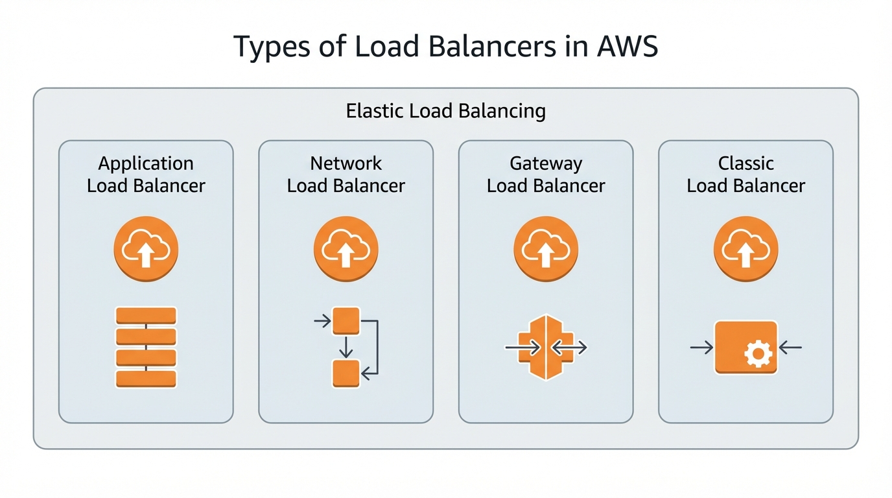
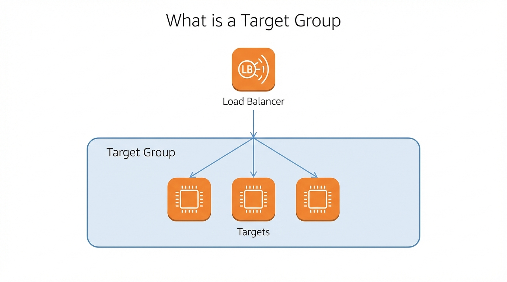
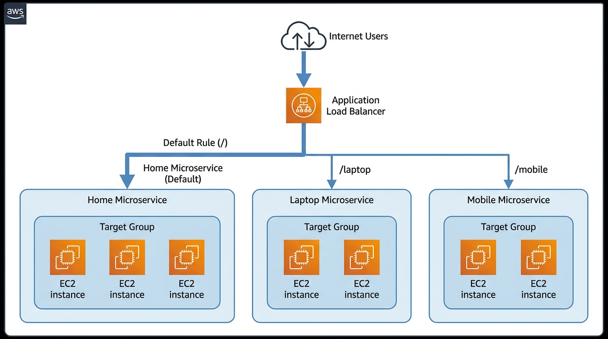
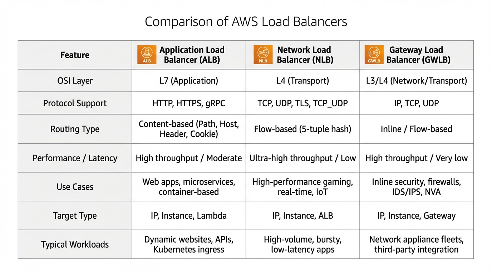

# Day 8: AWS Load Balancers

## Introduction to Load Balancers

Understanding AWS Load Balancers is essential for:
- **High Availability**: Distributing traffic across multiple servers
- **Scalability**: Handling increasing traffic loads
- **Performance**: Optimizing application response times
- **Interview Preparation**: Common AWS interview topics
- **Certification Exams**: Core topic in AWS certifications (Solutions Architect, SysOps, etc.)
- **Real-world Applications**: Foundation for building resilient applications

---

## 1. What is a Load Balancer?

### Definition

A **Load Balancer** is a networking device or service that distributes incoming network traffic across multiple servers, instances, or resources to ensure no single server becomes overwhelmed. It acts as a traffic manager, intelligently routing requests to healthy servers to maintain application availability and performance.

### Simple Explanation

Think of a Load Balancer as a smart traffic police officer at a busy intersection. When many cars (requests) come from different directions (users), the officer (Load Balancer) directs them to different roads (servers) to avoid traffic jams. If one road (server) is closed or busy, the officer redirects traffic to other open roads (healthy servers). This ensures smooth traffic flow and prevents any single road from getting too crowded.

### Detailed Explanation

A Load Balancer sits between your users and your application servers. When a user makes a request to your application, instead of going directly to a server, the request first reaches the Load Balancer. The Load Balancer then:

1. **Receives the Request**: Accepts incoming traffic from clients
2. **Health Checks**: Monitors the health of backend servers
3. **Selects Target**: Chooses the best server to handle the request
4. **Routes Traffic**: Forwards the request to the selected server
5. **Returns Response**: Receives response from server and sends it back to client

### Key Characteristics

#### 1. **Traffic Distribution**
- Distributes incoming requests across multiple servers
- Prevents any single server from being overloaded
- Ensures even distribution of workload
- Improves overall system performance

#### 2. **Health Monitoring**
- Continuously checks health of backend servers
- Automatically stops sending traffic to unhealthy servers
- Removes failed servers from rotation
- Adds servers back when they become healthy

#### 3. **High Availability**
- Provides redundancy and fault tolerance
- Ensures application remains available even if some servers fail
- Automatically routes traffic away from failed servers
- Maintains service continuity

#### 4. **Scalability**
- Handles increasing traffic loads
- Can distribute traffic to newly added servers
- Supports dynamic scaling of backend resources
- Accommodates traffic growth

#### 5. **SSL/TLS Termination**
- Handles SSL/TLS encryption and decryption
- Reduces load on backend servers
- Centralizes certificate management
- Simplifies security configuration

### How Load Balancer Works

#### Basic Flow

1. **Client Request**: User sends request to application
2. **Load Balancer Receives**: Request reaches Load Balancer (not directly to server)
3. **Health Check**: Load Balancer checks which servers are healthy
4. **Server Selection**: Load Balancer selects best server using algorithm (round-robin, least connections, etc.)
5. **Request Forwarding**: Load Balancer forwards request to selected server
6. **Server Processing**: Server processes request and generates response
7. **Response Return**: Server sends response back to Load Balancer
8. **Client Delivery**: Load Balancer delivers response to original client

#### Load Balancing Algorithms

**Round Robin**: Distributes requests evenly to each server in rotation
**Least Connections**: Sends request to server with fewest active connections
**IP Hash**: Routes requests based on client IP address (session affinity)
**Weighted**: Distributes traffic based on server capacity or priority

---

## 2. Why Load Balancer is Required?

### Problem Without Load Balancer

#### 1. **Single Point of Failure**

**Problem**: 
- If you have only one server and it fails, your entire application goes down
- No redundancy means complete service outage
- Users cannot access your application

**Impact**:
- Business loss due to downtime
- Poor user experience
- Loss of revenue
- Damage to reputation

#### 2. **Server Overload**

**Problem**:
- Single server cannot handle high traffic
- Server becomes slow or unresponsive
- Requests timeout or fail
- Poor performance during peak times

**Impact**:
- Slow response times
- User frustration
- Potential loss of customers
- Poor application performance

#### 3. **No Scalability**

**Problem**:
- Cannot easily add more servers to handle traffic
- Manual configuration required for each server
- Difficult to distribute traffic manually
- Cannot respond quickly to traffic spikes

**Impact**:
- Cannot handle traffic growth
- Limited capacity
- Manual intervention required
- Slow response to changing demands

#### 4. **Uneven Workload Distribution**

**Problem**:
- Some servers may be overloaded while others are idle
- Manual traffic routing is inefficient
- No automatic load distribution
- Resources not utilized optimally

**Impact**:
- Wasted resources
- Poor performance
- Inefficient infrastructure
- Higher costs

### Solutions Provided by Load Balancer

#### 1. **High Availability**

**Solution**:
- Distributes traffic across multiple servers
- If one server fails, traffic automatically goes to other servers
- Application remains available even during server failures
- Provides redundancy and fault tolerance

**Benefit**:
- Reduced downtime
- Better reliability
- Improved user experience
- Business continuity

#### 2. **Improved Performance**

**Solution**:
- Distributes load evenly across servers
- Prevents server overload
- Reduces response times
- Optimizes resource utilization

**Benefit**:
- Faster response times
- Better user experience
- Efficient resource usage
- Scalable performance

#### 3. **Automatic Scaling**

**Solution**:
- Automatically routes traffic to newly added servers
- Integrates with Auto Scaling groups
- Handles traffic spikes automatically
- Supports dynamic infrastructure

**Benefit**:
- Handles traffic growth
- Automatic capacity management
- Cost-effective scaling
- No manual intervention

#### 4. **Health Monitoring**

**Solution**:
- Continuously monitors server health
- Automatically removes unhealthy servers
- Adds servers back when they recover
- Ensures only healthy servers receive traffic

**Benefit**:
- Improved reliability
- Automatic failure handling
- Better user experience
- Reduced manual monitoring

#### 5. **SSL/TLS Termination**

**Solution**:
- Handles SSL/TLS encryption at Load Balancer
- Reduces load on backend servers
- Centralizes certificate management
- Simplifies security configuration

**Benefit**:
- Better performance (servers don't handle encryption)
- Easier certificate management
- Centralized security
- Reduced server load

---

## 3. Types of Load Balancers in AWS

### Overview

AWS provides four types of Load Balancers, each designed for different use cases and requirements:

1. **Application Load Balancer (ALB)**: Layer 7 (Application Layer)
2. **Network Load Balancer (NLB)**: Layer 4 (Transport Layer)
3. **Gateway Load Balancer (GWLB)**: Layer 3 (Network Layer)
4. **Classic Load Balancer (CLB)**: Legacy (Layer 4 and Layer 7)

### Quick Comparison

| Feature | ALB | NLB | GWLB | CLB |
|---------|-----|-----|------|-----|
| **Layer** | Layer 7 | Layer 4 | Layer 3 | Layer 4/7 |
| **Protocols** | HTTP/HTTPS | TCP/UDP/TLS | IP | HTTP/HTTPS/TCP |
| **Performance** | High | Very High | High | Medium |
| **Use Case** | Web Applications | High Performance | Security Appliances | Legacy Applications |
| **Status** | Modern | Modern | Modern | Legacy |

---

## 4. Application Load Balancer (ALB) - Detailed Explanation

### Definition

**Application Load Balancer (ALB)** is a Layer 7 (Application Layer) load balancer that operates at the HTTP/HTTPS level. It can inspect the content of requests and make intelligent routing decisions based on the request content, such as URL path, host header, query parameters, and HTTP headers.

### Simple Explanation

Think of Application Load Balancer as a smart receptionist in a large office building. When visitors (requests) arrive, the receptionist (ALB) doesn't just send them to any random office (server). Instead, the receptionist looks at what the visitor needs (request content) and directs them to the right department (server) based on:
- What they're asking for (URL path)
- Which company they're visiting (host header)
- What service they need (content-based routing)

This ensures each visitor goes to the most appropriate department that can help them best.

### Key Characteristics

#### 1. **Layer 7 Load Balancing**
- Operates at Application Layer (HTTP/HTTPS)
- Can inspect request content
- Makes routing decisions based on request data
- Understands application-level protocols

#### 2. **Content-Based Routing**
- Routes based on URL path (/api, /images, /admin)
- Routes based on host header (api.example.com, www.example.com)
- Routes based on HTTP headers
- Routes based on query parameters
- Routes based on source IP

#### 3. **Target Groups**
- Routes to different target groups based on rules
- Each target group can have different servers
- Supports multiple target groups per ALB
- Flexible routing configuration

#### 4. **Path-Based Routing**
- Routes /api/* requests to API servers
- Routes /images/* requests to image servers
- Routes /admin/* requests to admin servers
- Different paths can go to different server groups

#### 5. **Host-Based Routing**
- Routes api.example.com to API servers
- Routes www.example.com to web servers
- Routes blog.example.com to blog servers
- Multiple domains can use same ALB

#### 6. **SSL/TLS Termination**
- Handles SSL/TLS certificates
- Terminates SSL at Load Balancer
- Reduces load on backend servers
- Supports multiple certificates

#### 7. **WebSocket Support**
- Supports WebSocket connections
- Maintains persistent connections
- Ideal for real-time applications
- Supports long-lived connections

#### 8. **HTTP/2 Support**
- Supports HTTP/2 protocol
- Better performance than HTTP/1.1
- Multiplexing and header compression
- Modern protocol support

### How ALB Works

#### Request Flow

1. **Client Request**: User sends HTTP/HTTPS request
2. **ALB Receives**: Request reaches Application Load Balancer
3. **Rule Evaluation**: ALB evaluates routing rules (path, host, headers)
4. **Target Group Selection**: ALB selects appropriate target group based on rules
5. **Health Check**: ALB checks health of servers in target group
6. **Server Selection**: ALB selects healthy server from target group
7. **Request Forwarding**: ALB forwards request to selected server
8. **Response**: Server processes and returns response
9. **Client Delivery**: ALB delivers response to client

#### Routing Rules

ALB uses rules to determine where to route traffic:

**Priority**: Rules are evaluated in priority order (1, 2, 3, etc.)
**Conditions**: Each rule has conditions (path, host, headers)
**Actions**: Each rule has actions (forward to target group, redirect, return fixed response)

**Example Rules**:
- Rule 1: If path is /api/* → Forward to API Target Group
- Rule 2: If host is blog.example.com → Forward to Blog Target Group
- Rule 3: Default → Forward to Web Target Group

### ALB Features

#### 1. **Listener Rules**
- Define routing rules for incoming requests
- Multiple rules per listener
- Rules evaluated in priority order
- Flexible condition matching

#### 2. **Sticky Sessions (Session Affinity)**
- Routes same user to same server
- Maintains session state
- Uses cookies for session persistence
- Configurable duration

#### 3. **Connection Draining**
- Gracefully removes servers from rotation
- Allows existing connections to complete
- Prevents abrupt connection termination
- Smooth server maintenance

#### 4. **Access Logs**
- Logs all requests to ALB
- Detailed request information
- Stored in S3 bucket
- Useful for analytics and debugging

#### 5. **CloudWatch Integration**
- Metrics for request count, latency, errors
- Real-time monitoring
- Alarms and notifications
- Performance tracking

### ALB Use Cases

#### 1. **Web Applications**
- Distribute traffic across web servers
- Handle HTTP/HTTPS traffic
- Support multiple domains
- Path-based routing for different services

#### 2. **Microservices Architecture**
- Route to different microservices based on path
- /api/users → User service
- /api/orders → Order service
- /api/products → Product service

#### 3. **Container-Based Applications**
- Load balance for ECS tasks
- Load balance for EKS pods
- Container service integration
- Dynamic target registration

#### 4. **Multi-Tenant Applications**
- Route based on host header
- Different tenants on different subdomains
- Isolated routing per tenant
- Shared infrastructure

### ALB Limitations

#### 1. **Layer 7 Only**
- Only supports HTTP/HTTPS
- Cannot handle TCP/UDP traffic
- Not suitable for non-HTTP protocols

#### 2. **Performance**
- Slightly higher latency than NLB
- More processing overhead
- Not ideal for extreme performance needs

#### 3. **Cost**
- Higher cost than NLB
- Charges per hour and per LCU (Load Balancer Capacity Unit)
- Can be expensive for high traffic

### ALB Best Practices

#### 1. **Use Multiple Target Groups**
- Separate target groups for different services
- Better organization and management
- Easier to scale independently

#### 2. **Configure Health Checks**
- Set appropriate health check intervals
- Configure healthy/unhealthy thresholds
- Monitor health check metrics

#### 3. **Enable Access Logs**
- Enable access logs for monitoring
- Analyze traffic patterns
- Debug issues

#### 4. **Use HTTPS**
- Always use HTTPS for production
- Terminate SSL at ALB
- Use AWS Certificate Manager for certificates

#### 5. **Optimize Rules**
- Order rules by priority (most specific first)
- Minimize number of rules
- Use default rule for catch-all

---

## 5. Network Load Balancer (NLB) - Basic Explanation

### Definition

**Network Load Balancer (NLB)** is a Layer 4 (Transport Layer) load balancer that operates at the TCP/UDP level. It can handle millions of requests per second with ultra-low latency. NLB is designed for extreme performance and is ideal for applications that require high throughput and low latency.

### Simple Explanation

Think of Network Load Balancer as a high-speed highway toll booth operator. The operator doesn't care about what's inside the vehicles (request content) - they just look at where the vehicle is coming from and where it's going (source and destination IP/port), and direct it to the fastest available route (server). This makes it extremely fast because there's no inspection of the vehicle contents, just quick routing based on network information.

### Key Characteristics

#### 1. **Layer 4 Load Balancing**
- Operates at Transport Layer (TCP/UDP)
- Routes based on IP address and port
- Does not inspect application content
- Very fast and efficient

#### 2. **Ultra-Low Latency**
- Lowest latency among AWS Load Balancers
- Optimized for performance
- Handles millions of requests per second
- Ideal for high-performance applications

#### 3. **Static IP Addresses**
- Provides static IP addresses per Availability Zone
- IP addresses don't change
- Useful for firewall whitelisting
- Better for integration with external systems

#### 4. **Preserves Source IP**
- Preserves original client IP address
- Backend servers see real client IP
- Useful for IP-based access control
- Better for logging and analytics

#### 5. **Zonal Isolation**
- Each Availability Zone has its own static IP
- Traffic stays within same AZ when possible
- Better performance and lower latency
- Reduced cross-AZ data transfer costs

#### 6. **Connection-Based Load Balancing**
- Routes based on TCP/UDP connections
- Maintains connection state
- Efficient connection handling
- Supports long-lived connections

### How NLB Works

#### Request Flow

1. **Client Connection**: Client establishes TCP/UDP connection
2. **NLB Receives**: Connection reaches Network Load Balancer
3. **Target Selection**: NLB selects target based on flow hash algorithm
4. **Connection Forwarding**: NLB forwards connection to selected target
5. **Data Flow**: Data flows directly between client and target
6. **Connection Maintenance**: NLB maintains connection state

#### Flow Hash Algorithm

NLB uses flow hash algorithm to select targets:
- **5-Tuple Hash**: Source IP, Destination IP, Source Port, Destination Port, Protocol
- Same flow always goes to same target
- Ensures connection consistency
- Efficient target selection

### NLB Use Cases

#### 1. **High-Performance Applications**
- Applications requiring ultra-low latency
- High-throughput requirements
- Real-time applications
- Gaming applications

#### 2. **TCP/UDP Traffic**
- Non-HTTP protocols
- Custom protocols
- Database connections
- Any TCP/UDP-based service

#### 3. **Static IP Requirements**
- Applications requiring static IPs
- Firewall whitelisting needs
- Integration with external systems
- IP-based access control

#### 4. **Extreme Scale**
- Millions of requests per second
- Very high traffic volumes
- Auto Scaling integration
- Elastic scaling

### NLB Limitations

#### 1. **No Content-Based Routing**
- Cannot route based on request content
- Only routes based on IP and port
- Not suitable for path-based routing

#### 2. **No SSL/TLS Termination**
- Does not terminate SSL/TLS
- Backend servers must handle SSL
- More complex certificate management

#### 3. **Connection-Based**
- Routes based on connections, not requests
- Less flexible than ALB
- Limited routing options

### NLB Best Practices

#### 1. **Use for High Performance**
- Use when performance is critical
- Choose NLB for extreme throughput needs
- Ideal for low-latency requirements

#### 2. **Static IP Management**
- Use static IPs for firewall rules
- Document IP addresses per AZ
- Plan for IP whitelisting

#### 3. **Health Checks**
- Configure appropriate health checks
- Monitor target health
- Set proper thresholds

---

## 6. Gateway Load Balancer (GWLB) - Basic Explanation

### Definition

**Gateway Load Balancer (GWLB)** is a Layer 3 (Network Layer) load balancer that operates at the IP packet level. It is specifically designed to deploy, scale, and manage third-party virtual network appliances, such as firewalls, intrusion detection systems, and deep packet inspection systems.

### Simple Explanation

Think of Gateway Load Balancer as a security checkpoint at the entrance of a building. All traffic (packets) must pass through this checkpoint, where security appliances (firewalls, scanners) inspect every packet before allowing it to proceed. The checkpoint (GWLB) distributes the inspection work across multiple security stations (appliances) to handle high traffic volumes efficiently.

### Key Characteristics

#### 1. **Layer 3 Load Balancing**
- Operates at Network Layer (IP level)
- Routes IP packets
- Transparent to applications
- Works with any IP-based protocol

#### 2. **Virtual Appliance Integration**
- Designed for virtual network appliances
- Firewalls, IDS/IPS, DPI systems
- Third-party security appliances
- Network function virtualization (NFV)

#### 3. **Transparent Routing**
- Transparent to applications
- Applications don't need changes
- Works with existing infrastructure
- Seamless integration

#### 4. **GENEVE Protocol**
- Uses GENEVE (Generic Network Virtualization Encapsulation) protocol
- Encapsulates traffic to appliances
- Preserves original packet information
- Standard protocol support

#### 5. **Centralized Security**
- Central point for security inspection
- All traffic passes through appliances
- Consistent security policies
- Simplified security management

### How GWLB Works

#### Traffic Flow

1. **Traffic Arrives**: Traffic arrives at Gateway Load Balancer
2. **Packet Inspection**: GWLB inspects IP packets
3. **Appliance Selection**: GWLB selects virtual appliance
4. **Encapsulation**: Traffic is encapsulated using GENEVE
5. **Appliance Processing**: Virtual appliance inspects/processes traffic
6. **Return Path**: Processed traffic returns through GWLB
7. **Decapsulation**: GWLB removes encapsulation
8. **Forwarding**: Traffic is forwarded to destination

### GWLB Use Cases

#### 1. **Security Appliances**
- Firewall deployment
- Intrusion Detection/Prevention Systems
- Deep Packet Inspection
- Network security scanning

#### 2. **Compliance and Governance**
- Meet regulatory requirements
- Centralized security policies
- Audit and logging
- Security monitoring

#### 3. **Network Function Virtualization**
- Virtual network appliances
- Third-party security solutions
- Custom network functions
- NFV deployments

### GWLB Limitations

#### 1. **Specialized Use Case**
- Only for virtual appliances
- Not for general load balancing
- Specific to security/network functions

#### 2. **Complexity**
- More complex setup
- Requires virtual appliances
- GENEVE protocol knowledge needed

### GWLB Best Practices

#### 1. **Appliance Selection**
- Choose appropriate virtual appliances
- Ensure appliance compatibility
- Test appliance performance

#### 2. **Traffic Planning**
- Plan for traffic volumes
- Size appliances appropriately
- Monitor appliance capacity

---

## 7. Classic Load Balancer (CLB) - Legacy Note

### Definition

**Classic Load Balancer (CLB)** is the legacy load balancer that supports both Layer 4 (TCP) and Layer 7 (HTTP/HTTPS) load balancing. AWS recommends using Application Load Balancer or Network Load Balancer for new applications instead of Classic Load Balancer.

### Simple Explanation

Classic Load Balancer is like an old, reliable car that still works but doesn't have the modern features of newer models. It can do basic load balancing, but newer Load Balancers (ALB, NLB) have better features, performance, and capabilities. AWS still supports it for existing applications, but recommends migrating to newer options.

### Key Points

#### 1. **Legacy Status**
- Older generation load balancer
- AWS recommends migration to ALB or NLB
- Still supported but not recommended for new deployments
- Limited new features

#### 2. **Basic Functionality**
- Supports HTTP/HTTPS and TCP
- Basic load balancing features
- Health checks and SSL termination
- Limited routing capabilities

#### 3. **Migration Path**
- AWS provides migration tools
- Can migrate to ALB or NLB
- Plan migration for existing applications
- Test thoroughly before migration

### Why Not Use CLB?

#### 1. **Limited Features**
- No path-based routing
- No host-based routing
- Limited target group support
- Basic functionality only

#### 2. **Performance**
- Lower performance than ALB/NLB
- Higher latency
- Limited scalability
- Not optimized for modern workloads

#### 3. **Future Support**
- No new features being added
- Focus on ALB and NLB
- Migration recommended
- Future-proof your architecture

---

## 8. What is a Target Group?

### Definition

A **Target Group** is a logical grouping of targets (such as EC2 instances, IP addresses, or Lambda functions) that receive traffic from a Load Balancer. The Load Balancer routes traffic to targets in the target group based on routing rules and health checks.

### Simple Explanation

Think of a Target Group as a team of workers assigned to handle a specific type of task. When requests come in for that type of task, the manager (Load Balancer) sends the request to one of the workers (targets) in that team. The manager keeps track of which workers are available and healthy, and only sends work to workers who are ready to handle it.

### Key Characteristics

#### 1. **Logical Grouping**
- Groups similar targets together
- EC2 instances, IP addresses, Lambda functions
- Containers (ECS tasks, EKS pods)
- Flexible target types

#### 2. **Health Checks**
- Monitors health of targets
- Removes unhealthy targets
- Adds targets back when healthy
- Configurable health check settings

#### 3. **Routing Rules**
- Load Balancer routes to target groups based on rules
- Different rules can route to different target groups
- Path-based routing uses different target groups
- Host-based routing uses different target groups

#### 4. **Target Registration**
- Targets are registered with target group
- Can register/deregister dynamically
- Auto Scaling can automatically register targets
- Manual registration also supported

### Target Types

#### 1. **Instances**
- EC2 instances
- Traditional server-based targets
- Most common target type
- Instance-based health checks

#### 2. **IP Addresses**
- Private IP addresses
- On-premises servers
- Other VPC resources
- IP-based routing

#### 3. **Lambda Functions**
- Serverless functions
- Event-driven processing
- No servers to manage
- Pay per request

#### 4. **Application Load Balancer**
- ALB can be target of another ALB
- Nested load balancing
- Advanced routing scenarios
- Complex architectures

### Target Group Configuration

#### 1. **Health Check Settings**
- **Protocol**: HTTP, HTTPS, TCP
- **Path**: Health check path (for HTTP/HTTPS)
- **Port**: Health check port
- **Interval**: How often to check
- **Timeout**: How long to wait for response
- **Healthy Threshold**: Consecutive successes needed
- **Unhealthy Threshold**: Consecutive failures before marking unhealthy

#### 2. **Target Registration**
- **Auto Registration**: Automatically register with Auto Scaling
- **Manual Registration**: Manually add/remove targets
- **Deregistration Delay**: Time to wait before removing unhealthy target
- **Connection Draining**: Graceful removal of targets

#### 3. **Sticky Sessions**
- **Session Affinity**: Route same user to same target
- **Cookie-Based**: Uses cookies for session persistence
- **Duration**: How long to maintain session
- **Application-Controlled**: Cookie controlled by application

### Target Group Use Cases

#### 1. **Service Separation**
- Different target groups for different services
- API servers in one target group
- Web servers in another target group
- Database servers in separate target group

#### 2. **Environment Separation**
- Development target group
- Staging target group
- Production target group
- Different targets per environment

#### 3. **Blue/Green Deployments**
- Blue target group (current version)
- Green target group (new version)
- Switch traffic between groups
- Easy rollback capability

#### 4. **A/B Testing**
- Different target groups for different variants
- Route percentage of traffic to each variant
- Test different versions
- Gradual rollout

### Target Group Best Practices

#### 1. **Appropriate Health Checks**
- Set health check path correctly
- Configure appropriate intervals
- Set proper thresholds
- Monitor health check metrics

#### 2. **Target Registration**
- Use Auto Scaling for automatic registration
- Register targets in multiple AZs
- Ensure proper target distribution
- Monitor target registration

#### 3. **Connection Draining**
- Enable connection draining
- Set appropriate delay
- Allow graceful shutdown
- Prevent abrupt disconnections

#### 4. **Sticky Sessions**
- Use only when necessary
- Set appropriate duration
- Monitor session distribution
- Consider impact on scaling

---

## 9. Use Cases of Different Types of Load Balancers

### Application Load Balancer (ALB) Use Cases

#### 1. **Web Applications**
- **Scenario**: Hosting web applications with multiple services
- **Why ALB**: Path-based routing, host-based routing, HTTP/HTTPS support
- **Example**: E-commerce site with /products, /cart, /checkout paths

#### 2. **Microservices Architecture**
- **Scenario**: Multiple microservices behind single endpoint
- **Why ALB**: Route to different services based on path
- **Example**: /api/users → User service, /api/orders → Order service

#### 3. **Container-Based Applications**
- **Scenario**: ECS tasks or EKS pods
- **Why ALB**: Native container integration, dynamic target registration
- **Example**: Containerized microservices with auto-scaling

#### 4. **Multi-Tenant Applications**
- **Scenario**: Different tenants on different subdomains
- **Why ALB**: Host-based routing, multiple domains
- **Example**: tenant1.app.com, tenant2.app.com

#### 5. **API Gateway Alternative**
- **Scenario**: Simple API routing needs
- **Why ALB**: Path-based routing, lower cost than API Gateway
- **Example**: Internal APIs, simple routing requirements

### Network Load Balancer (NLB) Use Cases

#### 1. **High-Performance Applications**
- **Scenario**: Applications requiring ultra-low latency
- **Why NLB**: Lowest latency, highest throughput
- **Example**: Real-time trading platforms, gaming servers

#### 2. **TCP/UDP Traffic**
- **Scenario**: Non-HTTP protocols
- **Why NLB**: TCP/UDP support, Layer 4 load balancing
- **Example**: Database connections, custom protocols

#### 3. **Static IP Requirements**
- **Scenario**: Applications needing static IP addresses
- **Why NLB**: Provides static IPs per AZ
- **Example**: Firewall whitelisting, third-party integrations

#### 4. **Extreme Scale**
- **Scenario**: Millions of requests per second
- **Why NLB**: Handles extreme traffic volumes
- **Example**: High-traffic websites, content delivery

#### 5. **Preserve Source IP**
- **Scenario**: Applications needing real client IP
- **Why NLB**: Preserves original client IP address
- **Example**: IP-based access control, geolocation

### Gateway Load Balancer (GWLB) Use Cases

#### 1. **Security Appliances**
- **Scenario**: Deploying firewalls, IDS/IPS
- **Why GWLB**: Designed for virtual network appliances
- **Example**: Third-party firewall solutions, security scanning

#### 2. **Compliance Requirements**
- **Scenario**: Regulatory compliance needs
- **Why GWLB**: Centralized security inspection
- **Example**: Financial services, healthcare applications

#### 3. **Network Function Virtualization**
- **Scenario**: Virtual network functions
- **Why GWLB**: NFV support, appliance integration
- **Example**: Custom network functions, virtual appliances

### Classic Load Balancer (CLB) Use Cases

#### 1. **Legacy Applications**
- **Scenario**: Existing applications using CLB
- **Why CLB**: Already in use, migration planned
- **Example**: Older applications, migration in progress

#### 2. **Simple Load Balancing**
- **Scenario**: Basic load balancing needs
- **Why CLB**: Simple setup, basic features
- **Example**: Simple web applications (not recommended for new deployments)

---

## 10. Comparison Table: AWS Load Balancers

### Comprehensive Comparison

| Feature | Application Load Balancer (ALB) | Network Load Balancer (NLB) | Gateway Load Balancer (GWLB) | Classic Load Balancer (CLB) |
|---------|--------------------------------|----------------------------|------------------------------|----------------------------|
| **Layer** | Layer 7 (Application) | Layer 4 (Transport) | Layer 3 (Network) | Layer 4/7 |
| **Protocols** | HTTP, HTTPS | TCP, UDP, TLS | IP | HTTP, HTTPS, TCP |
| **Performance** | High | Very High (Ultra-low latency) | High | Medium |
| **Throughput** | High | Very High (Millions req/sec) | High | Medium |
| **Latency** | Low | Ultra-Low | Low | Medium |
| **Content-Based Routing** | Yes (Path, Host, Headers) | No | No | Limited |
| **SSL/TLS Termination** | Yes | No | No | Yes |
| **WebSocket Support** | Yes | Yes | Yes | Limited |
| **HTTP/2 Support** | Yes | No | No | No |
| **Static IP** | No | Yes (per AZ) | No | No |
| **Preserve Source IP** | No | Yes | Yes | No |
| **Target Types** | Instances, IPs, Lambda, ALB | Instances, IPs | Instances, IPs | Instances only |
| **Health Checks** | HTTP, HTTPS, TCP | TCP, HTTP, HTTPS | TCP, HTTP, HTTPS | HTTP, HTTPS, TCP |
| **Sticky Sessions** | Yes (Cookie-based) | Yes (5-tuple hash) | No | Yes |
| **Connection Draining** | Yes | Yes | Yes | Yes |
| **Access Logs** | Yes (S3) | Yes (S3) | Yes (S3) | Yes (S3) |
| **WAF Integration** | Yes | No | No | Yes |
| **Auto Scaling** | Yes | Yes | Yes | Yes |
| **Container Support** | Yes (ECS, EKS) | Yes (ECS, EKS) | Yes | Limited |
| **Lambda Support** | Yes | No | No | No |
| **Cost** | Medium-High | Medium | Medium | Low-Medium |
| **Use Case** | Web apps, Microservices | High performance, TCP/UDP | Security appliances | Legacy apps |
| **Status** | Modern (Recommended) | Modern (Recommended) | Modern (Recommended) | Legacy (Not recommended) |

### Quick Selection Guide

#### Choose ALB When:
- You need HTTP/HTTPS load balancing
- You need path-based or host-based routing
- You're building web applications or microservices
- You need SSL/TLS termination
- You're using containers (ECS/EKS)
- You need Lambda integration

#### Choose NLB When:
- You need ultra-low latency
- You need extreme performance (millions req/sec)
- You're using TCP/UDP protocols
- You need static IP addresses
- You need to preserve source IP
- Performance is critical

#### Choose GWLB When:
- You need to deploy security appliances
- You need firewall, IDS/IPS solutions
- You're implementing network function virtualization
- You need centralized security inspection
- Compliance requirements

#### Choose CLB When:
- You have existing legacy applications
- You're planning migration to ALB/NLB
- Simple load balancing needs (not recommended for new deployments)

---

## Summary

### Key Takeaways

1. **Load Balancer Purpose**: Distributes traffic across multiple servers for high availability and performance

2. **ALB**: Best for web applications, microservices, content-based routing (Layer 7)

3. **NLB**: Best for high performance, TCP/UDP traffic, static IPs (Layer 4)

4. **GWLB**: Best for security appliances, network functions (Layer 3)

5. **CLB**: Legacy option, not recommended for new deployments

6. **Target Groups**: Logical grouping of targets that receive traffic from Load Balancer

7. **Selection Criteria**: Choose based on protocol, performance needs, routing requirements

### Interview Questions Summary

- **What is Load Balancer?**: Device that distributes traffic across multiple servers
- **Why use Load Balancer?**: High availability, scalability, performance, fault tolerance
- **ALB vs NLB**: ALB for Layer 7 (HTTP), NLB for Layer 4 (TCP/UDP) and performance
- **What is Target Group?**: Logical grouping of targets that receive traffic
- **When to use ALB?**: Web apps, microservices, content-based routing
- **When to use NLB?**: High performance, TCP/UDP, static IPs

### Certification Exam Tips

1. **ALB Features**: Path-based routing, host-based routing, Lambda support
2. **NLB Features**: Ultra-low latency, static IPs, TCP/UDP support
3. **Target Groups**: Health checks, registration, sticky sessions
4. **Selection**: Understand when to use each type
5. **Health Checks**: Configuration and monitoring
6. **Integration**: Auto Scaling, ECS, EKS integration
7. **Cost**: Understand pricing model (ALB vs NLB)

---

## Conclusion

Understanding AWS Load Balancers is crucial for:
- **Building Resilient Applications**: High availability and fault tolerance
- **Scaling Applications**: Handle increasing traffic loads
- **Optimizing Performance**: Distribute load efficiently
- **Passing Certifications**: Core topic in AWS exams
- **Acing Interviews**: Common interview questions

Key takeaways:
- **Load Balancer**: Distributes traffic for high availability
- **ALB**: Layer 7, content-based routing, web applications
- **NLB**: Layer 4, high performance, TCP/UDP
- **GWLB**: Layer 3, security appliances
- **Target Groups**: Logical grouping of targets

Master these concepts to build scalable, highly available, and performant AWS applications.

