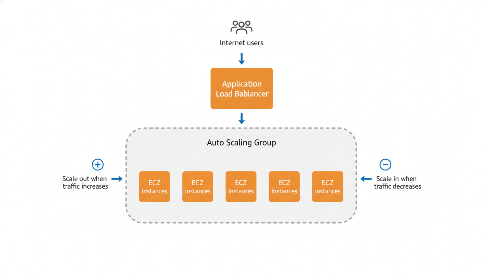
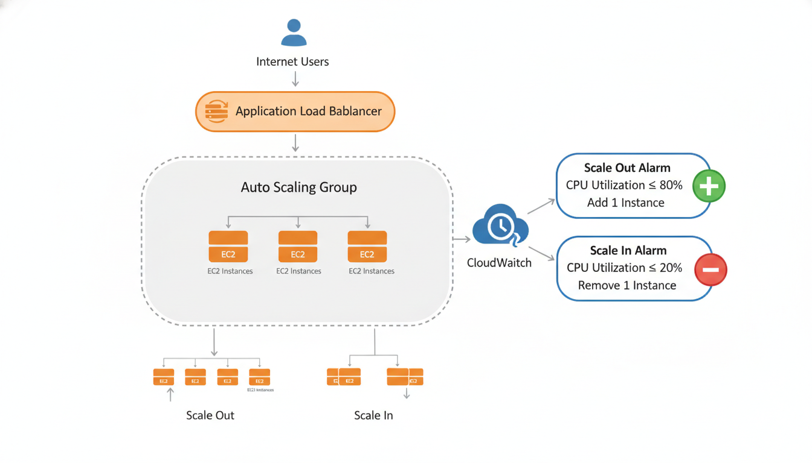

# Day 9: AWS Auto Scaling

## Introduction to Auto Scaling

Understanding AWS Auto Scaling is essential for:
- **Cost Optimization**: Pay only for resources you need
- **High Availability**: Automatically replace failed instances
- **Performance**: Maintain optimal performance during traffic changes
- **Interview Preparation**: Common AWS interview topics
- **Certification Exams**: Core topic in AWS certifications (Solutions Architect, SysOps, etc.)
- **Real-world Applications**: Foundation for building scalable and resilient applications

---

## 1. What is Auto Scaling?

### Definition

**Auto Scaling** is an AWS service that automatically adjusts the number of EC2 instances (or other resources) in your application based on demand, performance metrics, or schedules. It ensures you have the right number of instances running to handle your application's load while minimizing costs by removing instances when they're not needed.

### Simple Explanation

Think of Auto Scaling as a smart manager for a restaurant. During lunch time when many customers arrive, the manager (Auto Scaling) automatically calls in more waiters (instances) to handle the rush. When it's quiet in the afternoon with fewer customers, the manager sends some waiters home (terminates instances) to save money. The manager continuously monitors the restaurant's busyness (metrics) and adjusts the number of waiters automatically, ensuring customers are served well without wasting money on unnecessary staff.

### Detailed Definition

Auto Scaling is a fully managed AWS service that provides automatic scaling of your compute resources. It monitors your application and automatically adds or removes EC2 instances based on conditions you define. The service works seamlessly with other AWS services like EC2, Elastic Load Balancer, CloudWatch, and Launch Templates to provide a complete scaling solution.

#### Key Components

**1. Auto Scaling Group (ASG)**
- A logical grouping of EC2 instances that Auto Scaling manages
- Defines the minimum, maximum, and desired number of instances
- Specifies which instances to launch and how to distribute them
- Contains the scaling policies and health check settings

**2. Launch Template or Launch Configuration**
- Defines what type of instances to launch
- Specifies AMI, instance type, security groups, key pairs
- Contains user data scripts for instance configuration
- Determines the configuration of new instances

**3. Scaling Policies**
- Rules that define when to scale in or scale out
- Based on CloudWatch metrics (CPU, memory, network, custom metrics)
- Can be target tracking, step scaling, or simple scaling
- Defines how many instances to add or remove

**4. Health Checks**
- Monitors the health of instances in the Auto Scaling Group
- Replaces unhealthy instances automatically
- Uses EC2 health checks or ELB health checks
- Ensures desired capacity is maintained

### Key Characteristics

#### 1. **Automatic Scaling**

**What It Does**:
- Automatically adds instances when demand increases
- Automatically removes instances when demand decreases
- Responds to changes in real-time
- No manual intervention required

**Why It Matters**:
- Handles traffic spikes automatically
- Reduces costs during low traffic periods
- Maintains optimal performance
- Saves time and effort

#### 2. **Cost Optimization**

**What It Does**:
- Launches instances only when needed
- Terminates instances when not needed
- Prevents over-provisioning
- Reduces idle resource costs

**Why It Matters**:
- Pay only for what you use
- Significant cost savings
- Efficient resource utilization
- Better budget management

#### 3. **High Availability**

**What It Does**:
- Automatically replaces failed instances
- Distributes instances across Availability Zones
- Maintains minimum number of healthy instances
- Ensures application availability

**Why It Matters**:
- Reduces downtime
- Improves reliability
- Automatic failure recovery
- Better user experience

#### 4. **Performance Maintenance**

**What It Does**:
- Maintains optimal performance during traffic changes
- Scales up before performance degrades
- Scales down when performance is good
- Responds to performance metrics

**Why It Matters**:
- Consistent user experience
- Handles traffic spikes
- Prevents performance degradation
- Optimal resource utilization

#### 5. **Integration with AWS Services**

**What It Does**:
- Works with EC2 for instance management
- Integrates with Elastic Load Balancer for traffic distribution
- Uses CloudWatch for metrics and alarms
- Supports Launch Templates for instance configuration

**Why It Matters**:
- Seamless AWS ecosystem integration
- Comprehensive scaling solution
- Easy to configure and manage
- Leverages AWS best practices

### Types of Scaling

#### 1. **Scale Out (Scaling Up)**

**Definition**: Adding more instances to handle increased load

**When It Happens**:
- Traffic increases
- CPU utilization is high
- Memory usage is high
- Custom metrics exceed thresholds
- Scheduled scaling events

**How It Works**:
- Auto Scaling detects the need for more capacity
- Launches new instances based on Launch Template
- Registers new instances with Load Balancer (if configured)
- New instances start handling traffic

**Example**: Your application receives a sudden spike in traffic. Auto Scaling detects high CPU utilization and automatically launches 3 more instances to handle the load.

#### 2. **Scale In (Scaling Down)**

**Definition**: Removing instances when they're not needed

**When It Happens**:
- Traffic decreases
- CPU utilization is low
- Memory usage is low
- Custom metrics are below thresholds
- Scheduled scaling events

**How It Works**:
- Auto Scaling detects excess capacity
- Selects instances to terminate (oldest, newest, or closest to next billing hour)
- Drains connections from selected instances (if using Load Balancer)
- Terminates selected instances

**Example**: Traffic decreases during off-peak hours. Auto Scaling detects low CPU utilization and automatically terminates 2 instances to save costs.

#### 3. **Maintain Desired Capacity**

**Definition**: Keeping the number of instances at the desired level

**When It Happens**:
- Instances become unhealthy
- Instances are manually terminated
- Instances fail health checks

**How It Works**:
- Auto Scaling detects that current capacity is below desired
- Launches new instances to replace failed ones
- Maintains the desired number of healthy instances
- Ensures high availability

**Example**: One of your instances fails. Auto Scaling detects this and automatically launches a new instance to replace it, maintaining your desired capacity.

### Auto Scaling Benefits

#### 1. **Cost Savings**

**How**:
- Pay only for instances you need
- Automatically terminate idle instances
- Avoid over-provisioning
- Optimize resource utilization

**Impact**:
- Significant cost reduction
- Better budget management
- Efficient spending
- ROI improvement

#### 2. **Improved Availability**

**How**:
- Automatically replaces failed instances
- Distributes instances across Availability Zones
- Maintains minimum capacity
- Handles instance failures gracefully

**Impact**:
- Reduced downtime
- Better reliability
- Improved user experience
- Business continuity

#### 3. **Better Performance**

**How**:
- Scales up before performance degrades
- Handles traffic spikes automatically
- Maintains optimal performance
- Responds to metrics in real-time

**Impact**:
- Consistent performance
- Better user experience
- Handles peak loads
- Prevents performance issues

#### 4. **Automation**

**How**:
- No manual intervention required
- Automatic response to changes
- Self-healing infrastructure
- Reduces operational overhead

**Impact**:
- Saves time and effort
- Reduces human error
- Consistent operations
- Focus on business logic

#### 5. **Flexibility**

**How**:
- Multiple scaling policies
- Schedule-based scaling
- Metric-based scaling
- Custom scaling rules

**Impact**:
- Adapts to different scenarios
- Customizable behavior
- Flexible configuration
- Meets various requirements

### Auto Scaling Use Cases

#### 1. **Web Applications**

**Scenario**: Web application with variable traffic

**How Auto Scaling Helps**:
- Scales up during peak hours
- Scales down during off-peak hours
- Handles traffic spikes
- Maintains performance

**Example**: E-commerce website scales up during sale events and scales down during normal days.

#### 2. **API Services**

**Scenario**: REST API with unpredictable load

**How Auto Scaling Helps**:
- Responds to API request volume
- Handles sudden API traffic spikes
- Maintains low latency
- Cost-effective scaling

**Example**: Mobile app backend API scales based on number of active users.

#### 3. **Batch Processing**

**Scenario**: Processing jobs with varying workloads

**How Auto Scaling Helps**:
- Scales up for large batch jobs
- Scales down when jobs complete
- Handles peak processing times
- Optimizes compute costs

**Example**: Data processing pipeline scales up during data ingestion and scales down after processing.

#### 4. **Development and Testing**

**Scenario**: Development environments with scheduled usage

**How Auto Scaling Helps**:
- Scales down during non-working hours
- Scales up during working hours
- Saves costs on dev environments
- Schedule-based scaling

**Example**: Development environment scales to zero instances during nights and weekends.

#### 5. **High Availability Applications**

**Scenario**: Critical applications requiring high availability

**How Auto Scaling Helps**:
- Maintains minimum instances
- Replaces failed instances automatically
- Distributes across Availability Zones
- Ensures continuous availability

**Example**: Production application maintains minimum 3 instances across 3 Availability Zones.

---

## 2. How Auto Scaling Works (Basic Flow)

### Overview

Auto Scaling works by continuously monitoring your application's metrics and automatically adjusting the number of instances based on scaling policies you define. The process involves monitoring, evaluation, decision-making, and action execution.

### Basic Flow Explanation

#### Step 1: Monitoring

**What Happens**:
- Auto Scaling continuously monitors CloudWatch metrics
- Tracks metrics like CPU utilization, memory usage, network traffic
- Monitors custom metrics you define
- Checks health status of instances
- Evaluates current capacity vs desired capacity

**Metrics Monitored**:
- **CPU Utilization**: Percentage of CPU being used
- **Memory Utilization**: Amount of memory being used
- **Network In/Out**: Network traffic volume
- **Request Count**: Number of requests per second
- **Custom Metrics**: Application-specific metrics you define
- **ELB Metrics**: Metrics from Elastic Load Balancer (request count, response time)

**How It Works**:
- CloudWatch collects metrics from EC2 instances
- Metrics are aggregated and sent to Auto Scaling
- Auto Scaling evaluates metrics against thresholds
- Monitoring happens continuously (every 1-5 minutes)

**Example**: Auto Scaling monitors that your instances are running at 85% CPU utilization, which is above your threshold of 70%.

#### Step 2: Evaluation

**What Happens**:
- Auto Scaling evaluates current metrics against scaling policies
- Compares current capacity with desired capacity
- Checks if scaling conditions are met
- Determines if scaling action is needed
- Evaluates multiple metrics and policies

**Evaluation Criteria**:
- **Threshold Comparison**: Current metric vs threshold
- **Capacity Comparison**: Current instances vs desired instances
- **Health Status**: Number of healthy vs unhealthy instances
- **Policy Conditions**: Whether scaling policy conditions are met
- **Cooldown Periods**: Whether cooldown period has passed

**How It Works**:
- Auto Scaling compares metrics with thresholds in scaling policies
- If metric exceeds threshold, scale-out condition is met
- If metric is below threshold, scale-in condition may be met
- Evaluates all active scaling policies
- Makes decision based on policy with highest priority

**Example**: Auto Scaling evaluates that CPU is at 85% (above 70% threshold), current capacity is 3 instances, and desired capacity allows up to 10 instances. Scale-out condition is met.

#### Step 3: Decision Making

**What Happens**:
- Auto Scaling decides whether to scale in, scale out, or do nothing
- Determines how many instances to add or remove
- Checks constraints (min, max, desired capacity)
- Considers cooldown periods
- Makes scaling decision

**Decision Factors**:
- **Current Capacity**: How many instances are currently running
- **Desired Capacity**: Target number of instances
- **Minimum Capacity**: Minimum allowed instances
- **Maximum Capacity**: Maximum allowed instances
- **Scaling Policy**: What the policy says to do
- **Cooldown Period**: Whether enough time has passed since last scaling action

**How It Works**:
- If scale-out condition is met and current < max: Add instances
- If scale-in condition is met and current > min: Remove instances
- If current = desired: No action needed
- Respects min/max constraints
- Waits for cooldown period if needed

**Example**: Auto Scaling decides to add 2 instances because:
- CPU is above threshold (scale-out condition met)
- Current capacity (3) is below maximum (10)
- Desired capacity can be increased
- Cooldown period has passed

#### Step 4: Action Execution - Scale Out

**What Happens** (When Scaling Out):
- Auto Scaling launches new EC2 instances
- Uses Launch Template or Launch Configuration
- Distributes instances across Availability Zones
- Registers instances with Load Balancer (if configured)
- Waits for instances to become healthy

**Execution Steps**:
1. **Launch Instances**: Creates new EC2 instances based on Launch Template
2. **AZ Distribution**: Distributes instances across specified Availability Zones
3. **Load Balancer Registration**: Registers new instances with ELB (if configured)
4. **Health Check**: Waits for instances to pass health checks
5. **Traffic Routing**: Load Balancer starts routing traffic to new instances
6. **Capacity Update**: Updates current capacity to reflect new instances

**Time Taken**:
- Instance launch: 2-5 minutes
- Health check: 1-2 minutes
- Total: 3-7 minutes typically

**Example**: Auto Scaling launches 2 new instances. They start in different Availability Zones, get registered with the Load Balancer, pass health checks, and start receiving traffic. Capacity increases from 3 to 5 instances.

#### Step 5: Action Execution - Scale In

**What Happens** (When Scaling In):
- Auto Scaling selects instances to terminate
- Drains connections from selected instances (if using Load Balancer)
- Terminates selected instances
- Deregisters instances from Load Balancer
- Updates capacity

**Execution Steps**:
1. **Instance Selection**: Selects instances to terminate (oldest, newest, or closest to next billing hour)
2. **Connection Draining**: Drains existing connections from selected instances (if using ELB)
3. **Deregistration**: Removes instances from Load Balancer target group
4. **Termination**: Terminates selected EC2 instances
5. **Capacity Update**: Updates current capacity to reflect removed instances

**Selection Criteria** (Which instances to terminate):
- **Oldest Instance**: Terminates instance that has been running longest
- **Newest Instance**: Terminates most recently launched instance
- **Closest to Next Billing Hour**: Terminates instance closest to next billing hour (cost optimization)
- **AZ Balance**: Maintains balance across Availability Zones

**Time Taken**:
- Connection draining: 0-5 minutes (depending on active connections)
- Deregistration: Immediate
- Termination: 1-2 minutes
- Total: 1-7 minutes typically

**Example**: Auto Scaling selects 1 instance to terminate (oldest one). It drains connections, removes it from Load Balancer, terminates it, and updates capacity from 5 to 4 instances.

#### Step 6: Health Monitoring and Replacement

**What Happens**:
- Auto Scaling continuously monitors instance health
- Detects unhealthy instances
- Automatically replaces failed instances
- Maintains desired capacity
- Ensures high availability

**Health Check Types**:
- **EC2 Health Check**: Checks if instance is running and reachable
- **ELB Health Check**: Checks if instance passes Load Balancer health checks
- **Custom Health Check**: Uses custom health check scripts

**Replacement Process**:
1. **Health Check Failure**: Instance fails health check
2. **Mark as Unhealthy**: Auto Scaling marks instance as unhealthy
3. **Launch Replacement**: Launches new instance to replace failed one
4. **Wait for Health**: Waits for new instance to become healthy
5. **Terminate Failed**: Terminates the failed instance
6. **Maintain Capacity**: Ensures desired capacity is maintained

**Example**: One instance becomes unhealthy. Auto Scaling detects this, launches a new instance, waits for it to become healthy, and terminates the failed instance. Desired capacity is maintained.

### Complete Flow Example

**Scenario**: Web application experiencing traffic spike

**Step-by-Step Flow**:

1. **Initial State**: 
   - 3 instances running
   - CPU utilization: 45% (normal)

2. **Traffic Spike Occurs**:
   - Traffic increases suddenly
   - CPU utilization starts rising

3. **Monitoring (1 minute later)**:
   - Auto Scaling checks CloudWatch metrics
   - CPU utilization: 75% (above 70% threshold)

4. **Evaluation**:
   - Scale-out condition met (CPU > 70%)
   - Current capacity (3) < Maximum capacity (10)
   - Cooldown period has passed

5. **Decision**:
   - Decision: Scale out
   - Add 2 instances (based on scaling policy)

6. **Action - Launch**:
   - Launches 2 new EC2 instances
   - Distributes across Availability Zones
   - Uses Launch Template configuration

7. **Registration** (2 minutes later):
   - New instances start up
   - Register with Application Load Balancer
   - Begin health checks

8. **Health Check** (3 minutes later):
   - New instances pass health checks
   - Load Balancer starts routing traffic to them
   - Capacity: 3 → 5 instances

9. **Load Distribution**:
   - Traffic distributed across 5 instances
   - CPU utilization drops to 55%
   - Performance improves

10. **Stabilization**:
    - System stabilizes at 5 instances
    - CPU utilization: 55% (below threshold)
    - No further scaling needed

**Later - Traffic Decreases**:

11. **Monitoring** (30 minutes later):
    - Traffic decreases
    - CPU utilization: 35% (below 40% threshold)

12. **Evaluation**:
    - Scale-in condition met (CPU < 40%)
    - Current capacity (5) > Minimum capacity (2)
    - Cooldown period has passed

13. **Decision**:
    - Decision: Scale in
    - Remove 1 instance (based on scaling policy)

14. **Action - Termination**:
    - Selects oldest instance
    - Drains connections
    - Removes from Load Balancer
    - Terminates instance

15. **Capacity Update**:
    - Capacity: 5 → 4 instances
    - System stabilizes
    - Cost savings achieved

### Key Concepts in Auto Scaling Flow

#### 1. **Desired Capacity**

**Definition**: The target number of instances you want Auto Scaling to maintain

**How It Works**:
- Auto Scaling tries to maintain this number
- Automatically launches instances if below desired
- Automatically terminates instances if above desired
- Can be changed manually or by scaling policies

**Example**: Desired capacity is 5. If 1 instance fails, Auto Scaling launches 1 new instance to maintain 5.

#### 2. **Minimum Capacity**

**Definition**: The minimum number of instances that must always be running

**How It Works**:
- Auto Scaling will never go below this number
- Protects against scaling in too much
- Ensures minimum availability
- Safety constraint

**Example**: Minimum capacity is 2. Even if traffic is very low, Auto Scaling keeps at least 2 instances running.

#### 3. **Maximum Capacity**

**Definition**: The maximum number of instances that can be running

**How It Works**:
- Auto Scaling will never exceed this number
- Protects against excessive scaling
- Cost control mechanism
- Safety constraint

**Example**: Maximum capacity is 10. Even if traffic is very high, Auto Scaling will not launch more than 10 instances.

#### 4. **Cooldown Period**

**Definition**: The time period after a scaling action during which Auto Scaling won't perform another scaling action

**How It Works**:
- Prevents rapid scaling up and down
- Allows system to stabilize
- Default: 300 seconds (5 minutes)
- Can be customized per scaling policy

**Example**: After scaling out, Auto Scaling waits 5 minutes before evaluating scaling again, allowing new instances to stabilize.

#### 5. **Health Checks**

**Definition**: Checks performed to determine if instances are healthy

**How It Works**:
- EC2 health check: Basic instance health
- ELB health check: Application-level health
- Unhealthy instances are replaced
- Maintains desired number of healthy instances

**Example**: If an instance fails health check, Auto Scaling launches a replacement and terminates the failed instance.

### Auto Scaling Integration Points

#### 1. **CloudWatch Integration**

**How It Works**:
- CloudWatch collects metrics from EC2 instances
- Auto Scaling reads metrics from CloudWatch
- Scaling policies are based on CloudWatch alarms
- Metrics trigger scaling actions

**Example**: CloudWatch alarm triggers when CPU > 70%. Auto Scaling reads this alarm and scales out.

#### 2. **Elastic Load Balancer Integration**

**How It Works**:
- Auto Scaling registers new instances with Load Balancer
- Load Balancer distributes traffic to instances
- Auto Scaling uses ELB health checks
- Seamless traffic distribution

**Example**: When Auto Scaling launches new instances, they automatically register with Application Load Balancer and start receiving traffic.

#### 3. **Launch Template Integration**

**How It Works**:
- Launch Template defines instance configuration
- Auto Scaling uses Launch Template to launch instances
- Ensures consistent instance configuration
- Version control for instance configuration

**Example**: Auto Scaling uses Launch Template to launch instances with specific AMI, instance type, and security groups.

### Important Notes

#### 1. **Scaling Takes Time**

- Instance launch: 2-5 minutes
- Health checks: 1-2 minutes
- Total scaling time: 3-7 minutes
- Plan for scaling delays
- Don't expect instant scaling

#### 2. **Cost Considerations**

- Scaling out increases costs
- Scaling in reduces costs
- Balance performance and cost
- Set appropriate min/max limits
- Monitor costs regularly

#### 3. **Application Readiness**

- Instances need time to become ready
- Application must start quickly
- Health checks must pass
- Consider application startup time
- Optimize instance launch time

#### 4. **Multiple Metrics**

- Can use multiple metrics for scaling
- Different metrics may conflict
- Use target tracking for simplicity
- Monitor all relevant metrics
- Balance different scaling policies

#### 5. **Availability Zone Distribution**

- Auto Scaling distributes across AZs
- Maintains balance when possible
- Respects AZ constraints
- Ensures high availability
- Consider AZ capacity limits

---

## 3. Types of Auto Scaling (Brief)

### Overview

AWS Auto Scaling provides different types of scaling mechanisms to meet various application requirements. Each type has its own use case and is suitable for different scenarios. Understanding these types helps you choose the right scaling approach for your application.

### 1. **Dynamic Scaling**

**Definition**: Scaling based on real-time metrics and demand changes

**How It Works**:
- Monitors CloudWatch metrics continuously
- Responds to changes in CPU, memory, network, or custom metrics
- Automatically scales out when metrics exceed thresholds
- Automatically scales in when metrics are below thresholds
- Responds in real-time to traffic changes

**Use Cases**:
- Applications with unpredictable traffic patterns
- Web applications with variable load
- API services with fluctuating request volumes
- Applications requiring immediate response to demand changes

**Example**: E-commerce website scales out when CPU utilization exceeds 70% and scales in when it drops below 40%.

**Characteristics**:
- **Reactive**: Responds to actual demand
- **Real-time**: Adjusts based on current metrics
- **Flexible**: Works with various metrics
- **Automatic**: No manual intervention needed

### 2. **Predictive Scaling**

**Definition**: Scaling based on predicted demand using machine learning

**How It Works**:
- Uses machine learning to analyze historical traffic patterns
- Predicts future demand based on past trends
- Proactively scales before demand increases
- Learns from traffic patterns over time
- Combines with dynamic scaling for optimal results

**Use Cases**:
- Applications with predictable traffic patterns
- Applications with recurring peak times
- Services with known traffic cycles
- Applications requiring proactive scaling

**Example**: Video streaming service predicts high traffic during evening hours and scales up before the peak time arrives.

**Characteristics**:
- **Proactive**: Scales before demand increases
- **Intelligent**: Uses ML to predict patterns
- **Efficient**: Reduces scaling delays
- **Learning**: Improves predictions over time

### 3. **Scheduled Scaling**

**Definition**: Scaling based on predefined schedules and time-based rules

**How It Works**:
- Scales at specific times based on schedules you define
- Uses cron-like expressions for scheduling
- Scales to predefined capacity at scheduled times
- Useful for known traffic patterns
- Can combine multiple schedules

**Use Cases**:
- Applications with known peak hours
- Development environments with scheduled usage
- Applications with daily/weekly patterns
- Batch processing with scheduled runs

**Example**: Development environment scales to 0 instances during nights and weekends, and scales to 2 instances during working hours.

**Characteristics**:
- **Predictable**: Based on known schedules
- **Simple**: Easy to configure
- **Cost-effective**: Scales down during off-hours
- **Time-based**: Uses schedules, not metrics

### 4. **Manual Scaling**

**Definition**: Scaling performed manually by administrators

**How It Works**:
- Administrator manually changes desired capacity
- Auto Scaling adjusts instances to match desired capacity
- No automatic scaling based on metrics
- Full control over scaling decisions
- Useful for testing or specific scenarios

**Use Cases**:
- Testing scaling configurations
- Applications requiring manual control
- Specific scaling scenarios
- Temporary capacity adjustments

**Example**: Administrator manually increases desired capacity from 3 to 5 instances before a planned marketing campaign.

**Characteristics**:
- **Manual**: Requires administrator action
- **Controlled**: Full control over scaling
- **Simple**: No complex policies needed
- **Flexible**: Can be used for any scenario

### Comparison of Auto Scaling Types

| Type | Trigger | Response Time | Use Case | Complexity |
|------|---------|---------------|----------|------------|
| **Dynamic Scaling** | Real-time metrics | Fast (3-7 minutes) | Variable traffic | Medium |
| **Predictive Scaling** | ML predictions | Proactive | Predictable patterns | High |
| **Scheduled Scaling** | Time schedules | Immediate | Known patterns | Low |
| **Manual Scaling** | Administrator | Immediate | Testing, control | Low |

### Choosing the Right Type

#### Use Dynamic Scaling When:
- Traffic patterns are unpredictable
- You need real-time response to demand
- Application load varies frequently
- You want automatic scaling based on metrics

#### Use Predictive Scaling When:
- Traffic patterns are predictable
- You have historical traffic data
- You want to scale before demand increases
- You want to reduce scaling delays

#### Use Scheduled Scaling When:
- Traffic patterns follow known schedules
- You have fixed peak hours
- You want simple, time-based scaling
- Development/testing environments

#### Use Manual Scaling When:
- You need full control over scaling
- Testing scaling configurations
- Specific one-time scenarios
- Temporary capacity adjustments

---

## 4. Real-World Case Scenarios

### Case Scenario 1: E-Commerce Website During Flash Sale

#### Business Context

**Company**: Online fashion retailer
**Application**: E-commerce website selling clothing and accessories
**Challenge**: Handling massive traffic spike during flash sale events
**Requirements**: 
- Handle 10x normal traffic during sales
- Maintain fast response times
- Minimize costs during normal operations
- Ensure high availability

#### Initial Setup

**Before Auto Scaling**:
- Fixed 5 EC2 instances running 24/7
- Cost: ~$500/month for instances
- Problem: Instances overloaded during sales, slow response times
- Issue: Paying for unused capacity during normal times

**Auto Scaling Configuration**:
- **Minimum Capacity**: 3 instances (normal operations)
- **Desired Capacity**: 3 instances (starting point)
- **Maximum Capacity**: 20 instances (flash sale capacity)
- **Scaling Policy**: Target tracking on CPU utilization (target: 60%)
- **Health Checks**: ELB health checks enabled
- **Launch Template**: t3.medium instances with web server AMI

#### The Scenario: Flash Sale Event

**Day Before Sale**:
- Normal traffic: 1,000 requests per minute
- Current capacity: 3 instances
- CPU utilization: 35% (normal)
- System running smoothly

**Sale Announcement** (2 hours before sale):
- Marketing team announces flash sale on social media
- Traffic starts increasing gradually
- Current capacity: 3 instances
- CPU utilization: 45% (increasing)

**30 Minutes Before Sale**:
- Traffic: 3,000 requests per minute (3x increase)
- Current capacity: 3 instances
- CPU utilization: 75% (above 60% target)
- Auto Scaling triggers scale-out action

**Auto Scaling Action**:
1. **Monitoring**: CloudWatch detects CPU at 75%
2. **Evaluation**: CPU > 60% target, current capacity (3) < max (20)
3. **Decision**: Scale out by adding 2 instances
4. **Execution**: Launches 2 new t3.medium instances
5. **Registration**: New instances register with Application Load Balancer
6. **Health Check**: New instances pass health checks (2 minutes)
7. **Traffic Distribution**: Load Balancer starts routing traffic to new instances
8. **Result**: Capacity increases to 5 instances, CPU drops to 55%

**Sale Starts** (Peak Traffic):
- Traffic: 10,000 requests per minute (10x normal)
- Current capacity: 5 instances
- CPU utilization: 85% (still above target)
- Auto Scaling triggers another scale-out

**Second Auto Scaling Action**:
1. **Monitoring**: CPU still at 85% after cooldown period
2. **Evaluation**: Need more capacity, current (5) < max (20)
3. **Decision**: Scale out by adding 3 more instances
4. **Execution**: Launches 3 new instances
5. **Result**: Capacity increases to 8 instances, CPU drops to 65%

**Continued Scaling**:
- Traffic continues to increase
- Auto Scaling adds more instances as needed
- Peak capacity reached: 15 instances
- CPU utilization stabilizes at 58% (near target)
- All instances healthy and handling traffic

**Sale Ends** (Traffic Decreases):
- Traffic: 4,000 requests per minute (decreasing)
- Current capacity: 15 instances
- CPU utilization: 35% (below 40% threshold for scale-in)
- Auto Scaling triggers scale-in action

**Scale-In Action**:
1. **Monitoring**: CPU at 35% (below 40% threshold)
2. **Evaluation**: Excess capacity, current (15) > min (3)
3. **Decision**: Scale in by removing 2 instances
4. **Selection**: Selects oldest instances to terminate
5. **Connection Draining**: Drains connections from selected instances (1 minute)
6. **Termination**: Terminates 2 instances
7. **Result**: Capacity decreases to 13 instances

**Gradual Scale-In**:
- Traffic continues decreasing
- Auto Scaling gradually removes instances
- After 2 hours: Capacity at 5 instances
- After 4 hours: Capacity at 3 instances (back to normal)
- CPU utilization: 38% (normal operations)

#### Results and Benefits

**Performance**:
- ✅ Website remained fast during entire sale (response time < 500ms)
- ✅ No downtime or errors during peak traffic
- ✅ Handled 10x normal traffic successfully
- ✅ User experience maintained throughout

**Cost Optimization**:
- ✅ Normal operations: 3 instances (~$150/month)
- ✅ Peak operations: 15 instances (~$750 for sale day)
- ✅ Total cost: ~$200/month average (vs $500/month fixed)
- ✅ Cost savings: 60% reduction in monthly costs

**High Availability**:
- ✅ Instances distributed across 3 Availability Zones
- ✅ Automatic replacement of any failed instances
- ✅ No single point of failure
- ✅ 99.9% uptime maintained

**Lessons Learned**:
- Auto Scaling handled traffic spike automatically
- No manual intervention required
- Cost savings significant during normal operations
- System scaled smoothly without performance degradation

### Case Scenario 2: Mobile App Backend API with Daily Traffic Patterns

#### Business Context

**Company**: Food delivery mobile app
**Application**: REST API backend for mobile application
**Challenge**: Handling daily traffic patterns with predictable peaks
**Requirements**:
- Handle lunch and dinner rush hours
- Minimize costs during off-peak hours
- Maintain low latency for API responses
- Support 24/7 operations

#### Initial Setup

**Before Auto Scaling**:
- Fixed 8 EC2 instances running 24/7
- Cost: ~$800/month for instances
- Problem: Instances underutilized during off-peak (2 AM - 10 AM)
- Issue: Paying for capacity not needed during low-traffic hours

**Auto Scaling Configuration**:
- **Minimum Capacity**: 2 instances (off-peak minimum)
- **Desired Capacity**: 4 instances (normal operations)
- **Maximum Capacity**: 12 instances (peak hours)
- **Scaling Policies**:
  - **Dynamic Scaling**: Target tracking on request count (target: 500 requests/minute per instance)
  - **Scheduled Scaling**: Scale to 8 instances at 11:00 AM (lunch prep), scale to 10 instances at 6:00 PM (dinner prep)
- **Health Checks**: ELB health checks with 30-second interval
- **Launch Template**: t3.small instances optimized for API workloads

#### The Scenario: Typical Day Traffic Pattern

**Early Morning** (2:00 AM - 6:00 AM):
- Traffic: 200 requests per minute (very low)
- Current capacity: 2 instances (minimum)
- Request count: 100 requests/minute per instance (below target)
- CPU utilization: 15% (very low)
- System: Running efficiently with minimal instances

**Morning** (6:00 AM - 10:00 AM):
- Traffic: 800 requests per minute (gradually increasing)
- Current capacity: 2 instances
- Request count: 400 requests/minute per instance (approaching target)
- Auto Scaling detects need for more capacity

**Auto Scaling Action - Morning**:
1. **Monitoring**: Request count approaching 500/minute per instance
2. **Evaluation**: Need more capacity, current (2) < max (12)
3. **Decision**: Scale out by adding 2 instances
4. **Execution**: Launches 2 new instances
5. **Result**: Capacity increases to 4 instances
6. **Request Distribution**: 200 requests/minute per instance (optimal)

**Pre-Lunch** (10:00 AM - 11:00 AM):
- Traffic: 2,000 requests per minute (increasing)
- Current capacity: 4 instances
- Request count: 500 requests/minute per instance (at target)
- System: Running at optimal capacity

**Scheduled Scaling - Lunch Prep** (11:00 AM):
- Scheduled scaling triggers at 11:00 AM
- Desired capacity changes from 4 to 8 instances
- Auto Scaling launches 4 new instances proactively
- Capacity increases to 8 instances before lunch rush

**Lunch Rush** (12:00 PM - 2:00 PM):
- Traffic: 4,500 requests per minute (peak lunch traffic)
- Current capacity: 8 instances
- Request count: 562 requests/minute per instance (above target)
- Dynamic scaling triggers additional scale-out

**Dynamic Scaling During Lunch**:
1. **Monitoring**: Request count at 562/minute per instance (above 500 target)
2. **Evaluation**: Need more capacity, current (8) < max (12)
3. **Decision**: Scale out by adding 2 instances
4. **Execution**: Launches 2 new instances
5. **Result**: Capacity increases to 10 instances
6. **Request Distribution**: 450 requests/minute per instance (optimal)

**Afternoon** (2:00 PM - 5:00 PM):
- Traffic: 1,500 requests per minute (decreasing)
- Current capacity: 10 instances
- Request count: 150 requests/minute per instance (below target)
- Auto Scaling triggers scale-in

**Scale-In After Lunch**:
1. **Monitoring**: Request count at 150/minute per instance (below target)
2. **Evaluation**: Excess capacity, current (10) > min (2)
3. **Decision**: Scale in by removing 4 instances
4. **Execution**: Terminates 4 instances gradually
5. **Result**: Capacity decreases to 6 instances
6. **Request Distribution**: 250 requests/minute per instance (optimal)

**Pre-Dinner** (5:00 PM - 6:00 PM):
- Traffic: 2,500 requests per minute (increasing)
- Current capacity: 6 instances
- Request count: 416 requests/minute per instance (approaching target)
- System: Preparing for dinner rush

**Scheduled Scaling - Dinner Prep** (6:00 PM):
- Scheduled scaling triggers at 6:00 PM
- Desired capacity changes from 6 to 10 instances
- Auto Scaling launches 4 new instances proactively
- Capacity increases to 10 instances before dinner rush

**Dinner Rush** (7:00 PM - 9:00 PM):
- Traffic: 5,000 requests per minute (peak dinner traffic)
- Current capacity: 10 instances
- Request count: 500 requests/minute per instance (at target)
- System: Running at optimal capacity
- Additional dynamic scaling may trigger if traffic exceeds capacity

**Evening** (9:00 PM - 11:00 PM):
- Traffic: 2,000 requests per minute (decreasing)
- Current capacity: 10 instances
- Request count: 200 requests/minute per instance (below target)
- Auto Scaling triggers scale-in

**Scale-In After Dinner**:
1. **Monitoring**: Request count at 200/minute per instance
2. **Evaluation**: Excess capacity, current (10) > min (2)
3. **Decision**: Scale in by removing 4 instances
4. **Execution**: Terminates 4 instances
5. **Result**: Capacity decreases to 6 instances

**Late Night** (11:00 PM - 2:00 AM):
- Traffic: 600 requests per minute (low)
- Current capacity: 6 instances
- Request count: 100 requests/minute per instance (below target)
- Auto Scaling continues scaling in
- Final capacity: 3 instances (above minimum for safety)

**Night** (2:00 AM):
- Traffic: 200 requests per minute (very low)
- Current capacity: 3 instances
- Request count: 67 requests/minute per instance
- System: Running at minimal capacity
- Cycle repeats next day

#### Results and Benefits

**Performance**:
- ✅ API response time maintained < 200ms during peak hours
- ✅ No API errors or timeouts during traffic spikes
- ✅ Smooth scaling transitions without service disruption
- ✅ Optimal performance at all traffic levels

**Cost Optimization**:
- ✅ Off-peak hours: 2-3 instances (~$100/month)
- ✅ Normal hours: 4-6 instances (~$200/month)
- ✅ Peak hours: 8-10 instances (~$400/month)
- ✅ Average monthly cost: ~$250/month (vs $800/month fixed)
- ✅ Cost savings: 69% reduction in monthly costs

**Traffic Handling**:
- ✅ Handled lunch rush (4,500 req/min) smoothly
- ✅ Handled dinner rush (5,000 req/min) efficiently
- ✅ Maintained capacity during predictable peaks
- ✅ Scaled down during off-peak automatically

**Operational Efficiency**:
- ✅ Scheduled scaling prepared for known peaks
- ✅ Dynamic scaling handled unexpected spikes
- ✅ No manual intervention required
- ✅ Automatic optimization based on traffic patterns

**Lessons Learned**:
- Combination of scheduled and dynamic scaling works best
- Proactive scaling (scheduled) reduces scaling delays
- Dynamic scaling handles unexpected traffic
- Significant cost savings with right configuration
- System adapts automatically to daily patterns

---

## Summary

### Key Takeaways

1. **Auto Scaling Definition**: Automatically adjusts number of instances based on demand, metrics, or schedules

2. **How It Works**: Monitors metrics → Evaluates conditions → Makes decisions → Executes scaling actions → Maintains health

3. **Types of Auto Scaling**: Dynamic (real-time metrics), Predictive (ML-based), Scheduled (time-based), Manual (administrator control)

4. **Scaling Actions**: Scale out (add instances), Scale in (remove instances), Maintain capacity (replace failed instances)

5. **Key Components**: Auto Scaling Group, Launch Template, Scaling Policies, Health Checks

6. **Integration**: Works with CloudWatch, ELB, EC2, Launch Templates

7. **Real-World Applications**: E-commerce flash sales, mobile app backends with daily patterns, cost optimization, high availability

### Interview Questions Summary

- **What is Auto Scaling?**: Service that automatically adjusts number of instances based on demand
- **How does Auto Scaling work?**: Monitors metrics, evaluates conditions, makes decisions, executes scaling actions
- **What are the benefits?**: Cost savings, high availability, better performance, automation
- **What is desired capacity?**: Target number of instances to maintain
- **What is cooldown period?**: Time to wait after scaling action before next scaling evaluation

### Certification Exam Tips

1. **Auto Scaling Components**: Understand ASG, Launch Template, Scaling Policies
2. **Scaling Types**: Know scale out, scale in, maintain capacity
3. **Capacity Settings**: Understand min, max, desired capacity
4. **Health Checks**: Know EC2 and ELB health checks
5. **Integration**: Understand CloudWatch, ELB, EC2 integration
6. **Scaling Policies**: Know target tracking, step scaling, simple scaling
7. **Cooldown Periods**: Understand why and how they work

---

## Conclusion

Understanding AWS Auto Scaling is crucial for:
- **Building Scalable Applications**: Automatic scaling based on demand
- **Cost Optimization**: Pay only for resources you need
- **High Availability**: Automatic instance replacement
- **Passing Certifications**: Core topic in AWS exams
- **Acing Interviews**: Common interview questions

Key takeaways:
- **Auto Scaling**: Automatically adjusts instances based on demand
- **How It Works**: Monitor → Evaluate → Decide → Execute → Maintain
- **Benefits**: Cost savings, availability, performance, automation
- **Components**: ASG, Launch Template, Policies, Health Checks

Master these concepts to build scalable, cost-effective, and highly available AWS applications.

